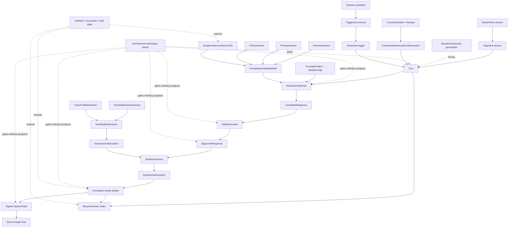

# Domain Information Model

Status: Proposed architecture reference; no schema, migration, prompt, policy, provider, runtime,
or production authority

Governing sources:

- [`AGENTS.md`](../../AGENTS.md)
- [`vnova-review-handoff.md`](../../vnova-review-handoff.md), especially sections 5 and 8
- [ADR-002: contract source and code generation](../adr/0002-contract-source-and-code-generation.md)
- [ADR-003: stream-session, segment, and turn lifecycle](../adr/0003-stream-session-segment-and-turn-lifecycle.md)
- [ADR-004: PostgreSQL outbox and Redis Streams](../adr/0004-postgresql-outbox-and-redis-streams.md)
- [ADR-007: provider gateway and fallback isolation](../adr/0007-provider-gateway-and-fallback-isolation.md)
- [ADR-008: safety gate enforcement](../adr/0008-safety-gate-enforcement.md)
- [ADR-010: approved media and TTS pipeline](../adr/0010-approved-media-and-tts-pipeline.md)
- [ADR-017: data retention, privacy, and PII](../adr/0017-data-retention-privacy-and-pii.md)
- [ADR-018: latency budget and streaming strategy](../adr/0018-latency-budget-and-streaming-strategy.md)
- [ADR-019: authentication, authorization, and operator roles](../adr/0019-authentication-authorization-and-operator-roles.md)
- [ADR-020: mode transition and degradation matrix](../adr/0020-mode-transition-and-degradation-matrix.md)
- [ADR-021: broadcast surfaces and overlay policy](../adr/0021-broadcast-surface-inventory-and-overlay-policy.md)
- [ADR-022: voice rights and talent licensing metadata](../adr/0022-voice-rights-and-talent-licensing-metadata.md)
- [ADR-023: event subject, scope, correlation, and ordering lanes](../adr/0023-event-subject-scope-correlation-and-ordering.md)
- [ADR-024: versioned configuration and scoped activation](../adr/0024-versioned-configuration-and-scoped-activation.md)
- [ADR-025: session actor ownership, command ingress, and fencing](../adr/0025-session-actor-ownership-command-ingress-and-fencing.md)

This document consolidates the conceptual information model already required by the handoff and
ADRs. It does not prescribe tables, columns, indexes, APIs, serialized contracts, storage
products, retention values, prompt text, policy defaults, provider settings, or role assignments.
Any database realization requires accepted upstream ADRs and a linked migration ADR.

## Modeling Rules

1. **Authority is explicit.** A record that describes an observation, provider result, cache
   entry, or transport message cannot be treated as an authorization.
2. **Identity is stable and scoped.** Mutable names, labels, aliases, vendor IDs, and display
   values do not replace VNova-owned identities.
3. **Decision inputs are immutable.** A decision binds exact input identities, digests, versions,
   scope, actor, time bounds, and policy. Changing an input requires a new decision.
4. **Lifecycle state is monotonic where safety depends on it.** Terminal decisions, expiry,
   cancellation, revocation, and deletion cannot be reopened by retry, reconnect, restore, cache
   fill, or replay.
5. **Configuration is versioned and activated separately.** Editing a draft definition never
   mutates the version that governed completed work.
6. **Content and evidence are separated.** Ordinary audit and telemetry contain identifiers,
   digests, versions, timings, and outcomes, not restricted source values.
7. **Derived data never becomes source authority.** Redis, embeddings, indexes, caches, provider
   copies, rendered artifacts, and archives cannot reconstruct permission or reintroduce deleted
   source data into an active source/retrieval path. Separately classified retained public output
   remains subject to its own archive, deletion, hold, publication, and rights disposition.
8. **Unknown ownership, classification, lineage, or version is restrictive.** It blocks use,
   activation, persistence, or release rather than being filled by inference.

## Conceptual Relationship Map

The arrows below show explanatory lineage, not a database schema or package dependency graph.
Types governed only by Proposed ADRs remain non-authoritative until those ADRs are accepted.

No arrow permits a downstream record to mint or infer an upstream decision. In particular,
`SurfaceAuthorization` or `VoiceUseAuthorization` cannot replace `ApprovedResponse`, an artifact
cannot recreate any authorization, and a `SpeechTask` cannot contain raw generated text.

## Aggregate And Ownership Boundaries

| Information family                       | Authoritative owner                                                                                          | Core records                                                                                                                                                                     | Boundary rule                                                                                                                                                                 |
| ---------------------------------------- | ------------------------------------------------------------------------------------------------------------ | -------------------------------------------------------------------------------------------------------------------------------------------------------------------------------- | ----------------------------------------------------------------------------------------------------------------------------------------------------------------------------- |
| Broadcast execution                      | Exact active protected recovery generation plus PostgreSQL `SessionOwnership` generation per `StreamSession` | `StreamSession`, ownership/recovery barriers, commands, canonical trigger occurrences/claims, four-record effect lineage, `StreamPlan`, `Segment`, `Turn`, candidates, decisions | Shared ownership-row linearization plus composite actor fence and aggregate version protect normal work; new owner is recovery-only; Redis/process/heartbeat never authorizes |
| Safety authorization                     | `packages/safety`                                                                                            | `SafetyDecision`, `ApprovedResponse`; Proposed rights/surface decisions and authorizations                                                                                       | Only the protected mint boundary creates authorization capabilities; content, rights, and surface authority remain distinct                                                   |
| Operator identity and command provenance | Identity/authorization boundary plus owning domain service                                                   | `Operator`, authenticated session reference, authorization decision, submission recovery generation, command/idempotency record                                                  | Semantic digest excludes volatile credentials; receipt lookup and execution independently reauthorize; UI state/key possession is not authority                               |
| Versioned behavior definitions           | Protected configuration and activation boundary                                                              | non-selectable drafts, immutable persona/prompt/policy/provider/model/voice/surface/scheduler versions, eligibility and activation records                                       | Review binds immutable version/set digests; eligibility and activation are separate scoped, audited state                                                                     |
| Memory and knowledge                     | Purpose-specific data boundary                                                                               | typed viewer/character memory, knowledge sources, derived embeddings/indexes                                                                                                     | Viewer memory and audit never share tables, content, or access roles; derived data references a source and is rebuildable                                                     |
| Media and archive                        | Approved media and archive boundaries                                                                        | immutable artifact, recording, archive index, publication/use disposition                                                                                                        | Media retains exact authorization and rights lineage; technical availability never grants reuse, replay, publication, or derivative rights                                    |
| Operational evidence                     | Domain transaction, audit, telemetry, and stage-host journal boundaries                                      | audit/outbox references, event envelopes, logs, metrics, traces, local outcomes                                                                                                  | State plus audit/outbox commit together where required; telemetry and Redis do not become recovery truth                                                                      |

The five historical planes remain unresolved under OD-018. This table uses named responsibility
boundaries only and does not establish a replacement plane taxonomy.

## Identity And Version Contract

Every durable identity belongs to one semantic type and scope. Implementations must not accept a
generic string ID where cross-type substitution would be unsafe.

- VNova-owned identities are immutable after creation.
- External platform, identity-provider, provider, repository, artifact, and rig identifiers are
  stored with issuer/namespace and environment context; they are never assumed globally unique.
- Human-facing labels, display names, slugs, provider model aliases, and mutable tags are
  attributes, not keys or authorization evidence.
- A mutable authoring draft is non-selectable. Publishing creates a definition version whose
  identity, canonical digest, semantic content, author/provenance, and creation time are immutable
  from creation.
- Review and lifecycle eligibility use separate monotonic state/transition records that bind the
  exact immutable version or activation-set identity and digest.
- Activation state selects an exact eligible activation set, or records explicit inactive state,
  for an environment plus one approved typed target. Activation does not rewrite a definition or
  eligibility history.
- Historical records retain the exact activated version identities that governed them.
- Deactivation, supersession, expiry, suspension, and revocation are explicit state transitions;
  deleting or editing history is not a substitute.
- Command idempotency-key lookup is scoped to protected submission recovery generation,
  environment/session or owning aggregate, semantic command type, authenticated principal or
  trusted source, and the key. The canonical semantic digest/parameters are not part of lookup
  identity: they are stored on first acceptance and compared afterward, so reuse of the same
  protected scope/key with different canonical content conflicts and creates no second lineage.

Exact UUID, timestamp, Unicode, numeric, and serialized resource-profile semantics remain governed
by Proposed ADR-002. This reference does not activate a contract format.

## Versioned Behavior Definitions

### Persona, Prompt, And Policy

`PersonaVersion`, `PromptVersion`, and `PolicyVersion` are separate concepts:

- a persona version describes reviewed character identity and behavioral constraints;
- a prompt version identifies a reviewed template or assembly program, not a completed full
  prompt;
- a policy version contains decision rules and capability constraints, not provider responses or
  operator preferences;
- an activation record binds exact versions to scope after protected review;
- a completed turn records the activated versions it actually used.

Prompt and persona templates and policy defaults are protected files under `AGENTS.md`. This
document supplies no template, wording, category default, threshold, or activation authority.

### Provider And Model Configuration

`ProviderProfile` and `ModelConfig` identities keep provider selection out of domain code:

- an immutable profile definition represents a reviewed capability, vendor/failure domain,
  region/privacy posture, gateway version, credential class reference, and quota/cost policy
  reference;
- separate definition-version and activation-set eligibility records control reviewed
  eligibility, while a scoped `ActivationBinding` selects one exact currently eligible set;
- provider health, circuit, quota, and degradation state is an independent restrictive
  operational observation rather than eligibility history, activation authority, or a mutation
  of the definition;
- the model configuration represents immutable model and inference configuration without
  containing credentials;
- a request binds the exact profile/configuration, attempt, timeout, outer deadline, and prompt
  manifest;
- generation and model-based safety profiles must satisfy the independently reviewed
  correlated-failure rule;
- provider raw request/response content remains restricted and never becomes ordinary profile,
  audit, event, or telemetry content.

No vendor, model, region, endpoint, SDK, secret mechanism, quota, or timeout is selected here.

### Voice, Rights, And Surface Definitions

Voice and surface availability is modeled separately from permission:

- `VoiceProfileDefinition` identifies immutable technical voice configuration;
- `VoiceRightsGrantVersion` records human-verified rights evidence through restricted references;
- `VoiceRightsDecision` and `VoiceUseAuthorization` represent the Proposed rights decision chain;
- a surface definition identifies one closed renderer and its normalization, final-context,
  expiry, clear, emergency, and evidence behavior;
- `SurfaceDecision` and `SurfaceAuthorization` represent the Proposed exact-presentation decision
  chain.

These Proposed capabilities do not exist merely because this reference names them. ADR-021,
ADR-022, OD-023, OD-024, protected contract changes, and human legal/talent review remain
required.

## Broadcast Planning And Turn Lineage

`StreamSession` is the aggregate and serialization boundary for one rehearsal or live broadcast.
It references, but does not collapse:

- optional versioned plan and ordered/ad-hoc segment records;
- orthogonal lifecycle, requested/effective mode, emergency latch, and rig-connection axes;
- turns from viewer, operator, scheduled segment, idle filler, or system triggers;
- exact persona, prompt, policy, scheduler, provider, rights, voice, and surface versions;
- current rig binding, session/restrictive epoch, protected recovery generation, and ownership
  generation.

ADR-025 keeps the coordination records separate from the session business-state axes:

- one PostgreSQL `SessionOwnership` record plus the independently protected recovery generation
  form the exact composite actor fence; ownership generation is monotonic only within one
  recovery generation;
- every protected commit shares an ownership-row write conflict, post-conflict database time,
  and fixed lock order with renew/revoke/takeover;
- durable command intent/receipt precedes accepted acknowledgement, while one terminal outcome
  commits with the domain effect; normal framing preserves submission recovery generation and
  separates semantic digest from append-only volatile authorization observations;
- one monotonic normal-work admission status/epoch and committed source cut gates every command
  receipt, input promotion, timer path, turn admission, ordinary effect intent/send/advancing
  application, and every other ordinary Turn/candidate/approval/media/task/dispatch progression;
  closing drains a fixed prefix, permits only bounded evidence/restrictive/terminal non-advancing
  writes, and never reopens;
- session-owned external effects persist intent, send-authorized attempt, response observation,
  and application disposition across separate crash boundaries;
- canonical schedule-slot uniqueness, materialization-cursor CAS, and current claim
  token/revision permit at most one turn admission; and
- every successor starts recovery-only and crosses a source-serialized activation barrier with
  sealed stage-host evidence before progressing.

Aggregate version, actor ownership generation, normal-work admission epoch, session authorization
epoch, rig binding, operator-presence generation, and DR recovery generation are independent
authorities. See the
[session runtime execution model](session-runtime-execution-model.md).

`Turn`, `GenerationAttempt`, `CandidateResponse`, `SafetyDecision`, and `ApprovedResponse` follow
ADR-003 and ADR-008:

- one turn may have many attempts and candidates;
- a failed, timed-out, cancelled, malformed, or partial attempt creates no candidate;
- every complete retry, fallback, or rewrite output is a new immutable candidate;
- a candidate has at most one terminal safety decision;
- operator review completes the same decision lineage rather than creating a bypass;
- selection is explicit and same-turn;
- only the selected candidate's approving decision can back one approval;
- expiry, cancellation, fail-closed termination, and terminal decisions never reopen;
- retry, rewrite, fallback, reconnect, and restore never extend the authoritative deadline.

The detailed transition table remains in the
[session and turn state model](session-turn-state-model.md). No schema is authorized by either
document.

## Approved Content Snapshot

The safety-owned runtime `ApprovedResponse` capability and its durable approval record must not be
conflated with the mutable availability of a raw candidate row.

- Minting creates an immutable, approval-owned snapshot of the exact linguistic content covered
  by the approving `SafetyDecision`, its canonical digest, source candidate/decision IDs,
  provenance, scope, and non-extended `not_after`.
- The snapshot is stored in the restricted approved-content boundary or through an immutable
  restricted content reference owned by the approval record. It is not copied into public
  commands, events, ordinary audit, telemetry, URLs, or `SpeechTask`.
- Only `packages/safety` may create or authentically rehydrate the approval capability and durable
  record. A database row, content object, ID, or structurally similar value cannot manufacture it.
- The trusted approved-media/TTS gateway may resolve the snapshot by `approved_response_id` only
  after revalidating the persisted decision, selection, session, cancellation, expiry, rights,
  requested surface definition/policy/eligibility, and current restrictive state. The terminal
  `SurfaceDecision` and `SurfaceAuthorization` do not yet exist at this point.
- After resolution, the gateway produces the deterministic final presentation rendering. Before
  any provider call or presentation, the surface safety boundary evaluates that exact rendering
  and destination and, if allowed, mints the terminal decision/authorization bound to its digest.
  Any rendering, pronunciation, template, surface, destination, or policy change requires a fresh
  decision; no earlier surface authorization is reused.
- Candidate retention and approved-content retention are related but distinct policy decisions.
  Deleting or expiring a raw candidate must not silently leave an unclassified duplicate, and it
  must not make a retained approved record resolve to a different source.
- If policy deletes or makes the approved-content snapshot unavailable, new synthesis,
  regeneration, replay, or export fails closed. Existing separately retained public archive media
  follows its own current rights, deletion, hold, and publication disposition; it is not used to
  reconstruct the deleted approval content.
- Ordinary audit retains only approval/content IDs, approved privacy-safe references or
  appropriately classified digests, versions, actor/decision references, time bounds, and
  outcomes.

The exact physical representation and whether the content is colocated with or referenced from
the approval row require the linked migration ADR. ADR-008, ADR-010, and ADR-017 require protected
review to make this retention and resolution relationship binding before persistence work.

## Prompt Assembly And Restricted Generation

A completed provider request has two deliberately separated representations.

### Prompt Assembly Manifest

The ordinary operational representation contains only the minimum explanatory metadata:

- session, segment, turn, attempt, trigger, character/talent, and environment identities;
- persona, prompt, policy, scheduler, provider, model, normalization, and assembly versions;
- IDs and versions of retrieved memory and knowledge source records;
- token or size counts per named section and the total accepted request;
- a privacy-reviewed correlation reference, language/context metadata, deadline, and assembly
  outcome; any plain integrity digest derived from restricted text stays in the restricted
  boundary because low-entropy content may be guessable or linkable;
- redaction/scrubbing and input-eligibility outcomes by category, not source content.

The final field names and serialized contract require protected review. A manifest never contains
full prompt text, memory values, viewer messages, secrets, provider bodies, rights evidence, or
raw candidate content.

### Restricted Prompt And Candidate Records

If an accepted retention policy permits storage, the exact assembled prompt and raw candidate are
stored only in the restricted-generation boundary:

- access is denied by default and separated from ordinary audit, support, and memory roles;
- reveal requires a specific record, authorized purpose, logged reason, time-bounded access, and
  its own audit event;
- storage binds the manifest and restricted integrity digest without copying either content or a
  linkability-unsafe digest back into ordinary evidence;
- retention, hold, deletion, provider-copy, export, and breach behavior follow ADR-017 and the
  privacy runbooks;
- a missing restricted record never permits prompt or candidate reconstruction from logs,
  events, traces, embeddings, or provider metadata.

## Memory And Knowledge

Memory is not a transcript, prompt, audit log, or authority store.

### Viewer Memory

Viewer memory uses reviewed typed slots only. A record binds viewer, character/talent, slot type,
normalized value, source message/turn, extractor and scrubber versions, policy, confidence/review
state, lifecycle, and supersession. It cannot contain free-text instructions, authority claims,
hidden prompts, secrets, unresolved PII, or a general conversation summary.

Writes occur only through the post-turn extraction pipeline. Mode and operator-review rules remain
those in ADR-017 and the future accepted mode/policy decisions. Retrieval is scoped, bounded, and
inserted into a delimited untrusted-data section; the prompt manifest records retrieved IDs, not
values.

### Character Memory

Character memory is distinct from persona definitions and viewer memory. Its final taxonomy
remains a human decision, but any production form must:

- use reviewed, typed, purpose-specific records rather than an unrestricted instruction log;
- carry source, author/reviewer, character/talent scope, policy, lifecycle, and supersession;
- never mutate an immutable persona or prompt version;
- never create operator, policy, rights, safety, or tool authority;
- use scoped key lookup unless a protected decision explicitly changes ADR-017's vector posture.

### Session Context

Ephemeral and session context is current runtime state, not long-lived memory. Persisted recovery
state must be explicitly classified under the session aggregate or restricted data model. Process
memory, provider context, or Redis cache cannot become the recoverable source of truth.

### Knowledge Base

A knowledge record has an authoritative source, provenance, scope, rights/licensing disposition,
classification, review/lifecycle state, and deletion behavior. Embeddings and indexes:

- reference the source record;
- record model/version;
- remain rebuildable and non-authoritative;
- inherit the same or narrower purpose and access;
- are removed or quarantined when the source is deleted, revoked, expired, or held.

ADR-017 currently permits pgvector for the Knowledge Base only. OD-026 requires human
clarification of the legacy release terminology and vector scope before schema work.

## Recording And Session Archive

Actual capture, authorization lineage, and curated publication are separate records. None is an
unrestricted incident or training corpus.

- A `PlayoutObservation` or capture interval records what the rig/OBS actually presented,
  attempted, did not present, or cannot prove, including source clock evidence, gaps,
  interruptions, surface, artifact/media identity, and classification. It does not claim that the
  output was authorized.
- Authorization lineage records the content, rights, surface, task, epoch, and policy decisions
  that should have permitted an exact output. Approved-but-not-played and
  actually-played-without-valid-authorization remain representable and are never reconciled into
  a false success.
- A `RecordingAsset` records captured bytes and intervals under their own classification,
  integrity, custody, and retention. A `SessionArchive` is a curated index/publication
  disposition that may align authorized public output with actual observations and recordings.
- Raw candidates, full prompts, viewer memory, secrets, rights documents, and unpublished
  restricted inputs are not copied into the ordinary archive.
- Live-use authorization does not imply recording, replay, editing, clip, promotion, training,
  voice-conversion, or derivative-use permission.
- Deletion, correction, rights revocation, incident/legal hold, platform takedown, and publication
  state remain explicit dispositions.
- A recording or artifact digest proves byte identity, not current permission.
- Every voice playback, replay, export, and archive publication evaluates current rights and use
  context. That evaluation decides whether an existing authorization remains valid or a new one
  is required; archive policy cannot skip the rights check. Every surface presentation likewise
  follows its accepted current authorization policy.

Archive scope, retention, rights, publication, and alignment precision remain human decisions.

## Durable Workflow And Delivery Evidence

Durable workflow records have distinct responsibilities even when a future schema implements
some of them in one transaction:

| Record concept                                                            | Authority and mutability                                                                                                                                                                                                | Required relationship                                                                                                                                                                                                                                                                                                                                                                     |
| ------------------------------------------------------------------------- | ----------------------------------------------------------------------------------------------------------------------------------------------------------------------------------------------------------------------- | ----------------------------------------------------------------------------------------------------------------------------------------------------------------------------------------------------------------------------------------------------------------------------------------------------------------------------------------------------------------------------------------- |
| Domain state record                                                       | Current authoritative aggregate state with optimistic versioning                                                                                                                                                        | Mutation is owned by one aggregate boundary and commits with required audit/outbox evidence                                                                                                                                                                                                                                                                                               |
| `SessionOwnership` and transition                                         | Current protected recovery/ownership composite fence, process/phase/lease, shared row linearization, and append-only transition evidence                                                                                | Active composite fence/post-conflict lease join aggregate checks; takeover begins recovery-only                                                                                                                                                                                                                                                                                           |
| Normal-work admission and closure drain                                   | Monotonic per-session open/draining/closed epoch plus committed-prefix closure cut, immutable initial cause, optional monotonic lost-tail overlay, and lifecycle/terminal-target disposition                            | Command/auth-lineage/input/timer/Turn/effect/candidate/approval/media/task/dispatch ordinary progression shares its CAS; non-open permits only bounded evidence/restrictive/terminal non-advancing drain; PITR keeps restored open/draining/closed axes coherent, unresolved target blocks close, and closed never reopens                                                                |
| Recovery attempt/barrier and history completeness                         | Immutable commit-time source/schedule-cursor snapshots, separate post-cut operational cursor, invalidation revisions, sealed rig cursor, and trusted WAL/manifest lost-tail disposition                                 | Every recovery-attempt-bound probe write advances invalidation; activation CAS requires unchanged immutable frontiers/revisions, every such probe terminal/non-widening, and each enabled-scope source ambiguity resolved or explicitly capability-disabled, while excluding harmless operational-cursor progress; an unknown tail proves no absence and installs quarantine              |
| `CommandIntent`, receipt, and outcome                                     | Submission-generation-bound semantic intent, durable acceptance receipt, separate auth provenance, and one idempotent terminal disposition                                                                              | Timeout is observation; stale/unknown generation reconciles; lookup/current execution reauthorize; deadline expiry is final                                                                                                                                                                                                                                                               |
| `CommandAuthorizationObservation`                                         | Append-only minimized authentication/authorization evaluation bound to one command/principal/digest, policy/revocation epoch, and per-command lineage revision                                                          | Initial evidence commits with receipt; refreshed evidence never overwrites lineage; protected execution CASes the exact revision and selects one current unexpired observation under deterministic precedence; concurrent/newer ambiguity fails closed                                                                                                                                    |
| Trigger occurrence, timer claim, and firing disposition                   | Canonical nominal-slot identity, bounded materialization cursor, and composite-fence/current-claim coordination                                                                                                         | Claim expiry is not completion; occurrence revision/current token allow one turn or terminal omission                                                                                                                                                                                                                                                                                     |
| Effect intent, attempt, response observation, and application disposition | Ordinary intent/send/advancing application require exact active fence plus exact-open admission; intent-before-send, send authorization, durable normalized response, and separately fenced application remain distinct | Attempt means possibly sent; late/stale/unknown results cannot advance; non-idempotent ambiguity is not blindly replayed                                                                                                                                                                                                                                                                  |
| Recovery-probe intent, attempt, response observation, and disposition     | Separately typed four-role evidence lineage under exact active+draining-prefix or recovering+recovery-attempt/source binding, fresh time, allowlist, unextended deadline, stable idempotency, and finite capacity       | Read-only/restrictive and non-widening; originating fence is provenance and a current successor may terminalize without resend; zero-attempt/terminal-unknown are valid; negative/timeout/contradiction cannot prove absence/replay; every probe terminalizes and each bound source ambiguity resolves, stays permanently safe-quarantined, or is accountably disposed before final close |
| `AuditRecord`                                                             | Append-only minimized decision/action evidence; not a content or memory store                                                                                                                                           | References the exact actor, command, state version, decision, policy, scope, timing, and outcome                                                                                                                                                                                                                                                                                          |
| `DomainEventRecord`                                                       | Immutable description of one committed domain fact                                                                                                                                                                      | Originates from authoritative state; cannot create or replace that state                                                                                                                                                                                                                                                                                                                  |
| `OutboxRecord`                                                            | Immutable canonical envelope and payload, or an immutable payload reference/digest whose availability is guaranteed with the state commit                                                                               | Created atomically with the state fact; retry, claim, lease, delivery, and acknowledgement never change semantic identity                                                                                                                                                                                                                                                                 |
| `OutboxClaim`                                                             | Mutable bounded publisher claim/lease state, or equivalent concurrency control, with explicit owner and expiry                                                                                                          | References one outbox identity; stale ownership cannot alter the outbox fact                                                                                                                                                                                                                                                                                                              |
| `DeliveryAttempt`                                                         | Append-only normalized publish attempt, acknowledgement/reconciliation evidence, and explicit timeout/unknown outcome                                                                                                   | References one outbox/event identity; late success requires reconciliation rather than mutation of the fact                                                                                                                                                                                                                                                                               |
| `InboxConsumptionRecord`                                                  | Consumer-owned durable deduplication and side-effect outcome                                                                                                                                                            | Binds consumer/version, event identity, canonical digest, and atomic side effect where required                                                                                                                                                                                                                                                                                           |
| `IdempotencyRecord`                                                       | Original canonical command digest and stable outcome for one scoped key                                                                                                                                                 | Conflicting content under the same scope/key is rejected; expiry cannot reopen a terminal domain result                                                                                                                                                                                                                                                                                   |
| Stage-host journal record                                                 | Bounded local command/task/observation outcome and sequence evidence                                                                                                                                                    | Reconciles with PostgreSQL after reconnect but cannot manufacture cloud authority                                                                                                                                                                                                                                                                                                         |
| Incident/evidence manifest                                                | Minimized references to evidence under separate custody                                                                                                                                                                 | Does not copy restricted source values or become ordinary operational state                                                                                                                                                                                                                                                                                                               |

Redis stream entries, offsets, consumer-group state, traces, metrics, logs, and dashboards are
operational views. They cannot replace any record above. Retention, compaction, replay, poison
handling, and deletion remain governed by ADR-004, ADR-017, OD-016, and later accepted schema
decisions.

The complete pre-schema ownership, cardinality, orthogonal-state, content/evidence, and
retention/deletion inventory is maintained in the
[domain record lifecycle catalog](domain-record-lifecycle-catalog.md). Its rows remain
non-authorizing.

### Event Scope Has A Proposed Model But Is Not Yet Accepted

The current Proposed ADR-002 and envelope require `stream_session_id` on every event, while the
required catalog includes policy/prompt activation and memory operations that may be scoped to an
environment, talent, character, or viewer without an active session. No producer may invent a
session ID or activate those catalog entries to satisfy the current envelope.

ADR-023 now proposes one v2 envelope with a catalog-fixed typed primary scope, one authoritative
aggregate subject, a complete immutable event-contract identity,
`(aggregate_version, event_index)` subject-lane ordering, PostgreSQL-backed transition
manifest/high-water completeness, explicit correlation/causation, and optional session/turn
correlation. The
[scope and subject identity model](scope-and-subject-identity-model.md) supplies the detailed
identity taxonomy and a provisional mapping for all inactive catalog entries.

That proposal is not accepted architecture. Protected review must accept ADR-023 or a replacement
and record OD-033 before ADR-002 acceptance or any event activation. Payload schemas,
partitioning, authorization, compatibility, privacy, and recovery must follow the selected
model, OD-017, and exact catalog review.

## Data Separation Matrix

| Boundary              | May contain content                                    | Ordinary audit receives                                                     | Must not share an access role with                                 |
| --------------------- | ------------------------------------------------------ | --------------------------------------------------------------------------- | ------------------------------------------------------------------ |
| Viewer input          | Time-limited moderated source content                  | Source ID, privacy-reviewed reference, classification, timing, outcome      | Secrets; unrestricted audit export                                 |
| Viewer memory         | Approved typed slot value                              | Memory ID, slot category, policy/version, operation outcome                 | Audit readers and restricted-generation readers by default         |
| Restricted generation | Full prompt and raw candidate when retention permits   | Manifest/content IDs, privacy-reviewed references, reveal decision, outcome | Ordinary operator/support/telemetry roles                          |
| Safety/audit          | Decisions, versions, actors, hashes, timing, outcomes  | It is the minimized evidence boundary                                       | Viewer-memory content roles                                        |
| Rights evidence       | Restricted consent/license/voice evidence              | Evidence ID, version, digest, decision, expiry/revocation outcome           | General runtime/operator/support roles                             |
| Media/archive         | Authorized artifact or recording bytes                 | Artifact/archive ID, digest, authorization and disposition IDs              | Raw-generation and viewer-memory roles unless separately justified |
| Telemetry             | IDs, timings, counts, normalized categories and health | Not a substitute for audit                                                  | Every restricted content role                                      |

Physical table, database, object-store, account, key, and role design requires protected schema,
privacy, security, and migration review. The matrix defines minimum separation, not a deployment.

## Failure And Recovery Behavior

- Missing definition, activation, activation/eligibility epoch, source, version, digest,
  classification/protection overlay, purpose, owner, retention policy, transition completeness,
  or decision lineage blocks the affected use.
- Conflicting versions or activations do not use "latest" by timestamp or mutable label; the
  exact authoritative scoped activation must be reconciled.
- PostgreSQL recovery restores authoritative state, then reapplies newer restrictive epochs,
  deletion tombstones, holds, access/rights revocations, and current activation state before use.
- Actor recovery separately proves a new composite actor fence, source-serialized recovery cut,
  immutable cut-time source/schedule-cursor snapshots, unchanged invalidation revisions, and
  sealed stage-host cursor while classifying every pre-cut command, timer, effect,
  signing/dispatch, and possible playout. Harmless post-cut ingress advances only an excluded
  operational cursor; audience-bound ambiguity advances invalidation and the session
  authorization epoch.
- A new recovery generation does not repair a PITR tail. Unclosed command/effect/timer/
  restrictive ranges are `lost_tail_unknown`; absence cannot authorize reacceptance, replay,
  rematerialization, or audience enablement. Restored `open` enters coherent
  `Ending`/`draining(lost_tail_quarantine)` with a proven or unresolved target; restored
  `draining(normal_closure)` gains a monotonic quarantine overlay; restored atomic `closed`
  remains closed; and unresolved target blocks final close.
- Redis, provider records, object listings, archives, traces, or local journals cannot fill a
  missing authorization or decision.
- Restore candidates remain quarantined until the
  [privacy deletion and restore](../runbooks/privacy-deletion-and-restore-reconciliation.md) and
  [disaster recovery](../runbooks/disaster-recovery-and-continuity.md) gates pass.
- Missing content may remain missing; it is not reconstructed from evidence merely to make an
  incident record look complete.

## Required Realization Evidence

Before implementing the corresponding production data model, protected reviewers require:

- acceptance of the governing ADRs and every capability-specific OPEN decision;
- a field-level inventory mapping owner, class, purpose, source, consumers, retention, deletion,
  export, audit, and provider behavior;
- a linked migration ADR with aggregate, relationship, constraint, index, transaction, backup,
  restore, and rollback design;
- database rejection tests for cross-type IDs, cross-scope references, invalid decision chains,
  mutable historical versions, duplicate terminal decisions, deadline extension, and orphaned
  derived data;
- physical and role separation tests for memory, audit, restricted generation, rights, archive,
  and telemetry boundaries;
- property/concurrency tests for lineage, terminal closure, idempotency, activation races,
  supersession, deletion, revocation, restore, ownership acquire/renew/expiry/revoke/takeover,
  ownership-row ordering/stale composite fences, immutable recovery-cut snapshots versus
  excluded operational-cursor/no-starvation behavior, restored-open/draining/closed lost-tail
  lifecycle/admission coherence and unresolved-target blocking,
  submission-generation durable commands, four-record ordinary-effect crash boundaries,
  separately typed active-draining/recovering recovery-probe crash/binding/bound/no-widening
  behavior, and canonical timer/current-claim single admission;
- prompt-manifest tests proving explanatory reconstruction without restricted values;
- deletion and restore canaries across every source and derivative;
- exact contract, producer, consumer, privacy, threat-model, runbook, and operational-readiness
  review for each activated record type.

## OPEN Decisions

Human review must still decide:

- OD-033 acceptance or replacement of ADR-023's typed scope/subject, complete event-contract
  identity, aggregate-version/event-index ordering and transition completeness, correlation,
  authorization, compatibility, and privacy semantics before ADR-002 acceptance or catalog
  activation;
- OD-034 acceptance or replacement of ADR-024's stable definitions/scoped activation and the
  lifecycle catalog's ownership/recovery, command, effect, timer, restrictive-control,
  approved-content, restricted generation, memory/knowledge, archive/publication,
  classification, access, retention, and lifecycle profile;
- OD-009 retention, deletion/anonymization, hold, restore, provider-copy, and verification policy;
- OD-013 mode capability and memory-write authority; OD-014 acceptance of ADR-025 structural
  ownership/recovery plus scheduling, trigger, retry/rewrite, interruption, and catch-up policy;
- OD-021 serialized command/receipt/outcome and stage-host contract source/canonicalization;
- OD-029 independently retained recovery generation/high-water, PITR/lost-tail proof and
  deny-only ledger limits, restored actor/audience fencing, and failover/failback authority;
- OD-035 ownership lease/effect/timer/deadline/clock values and OD-037 command/effect/timer
  capacity/claim/recovery-drain bounds;
- OD-022 operator identity, capability, restricted reveal, activation, and separation of duties;
- Open Decisions OD-023, OD-024, and OD-025 for surface, voice-rights, media, archive, reuse, and
  authorization composition;
- OD-026 release terminology and vector-storage scope;
- exact schema, storage, encryption, access roles, retention, region, provider, and migration
  design.
