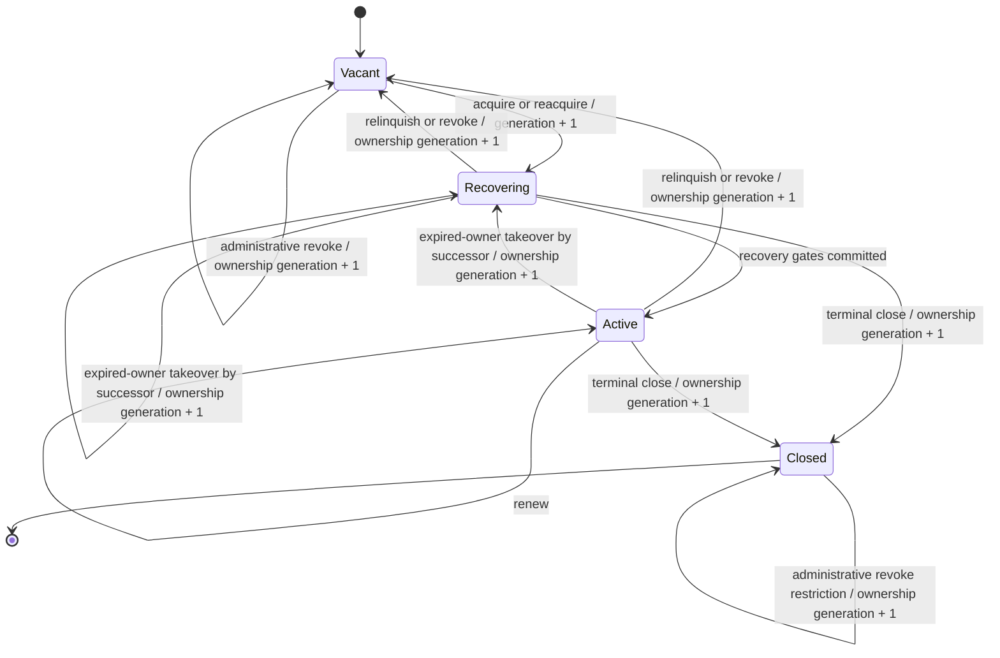
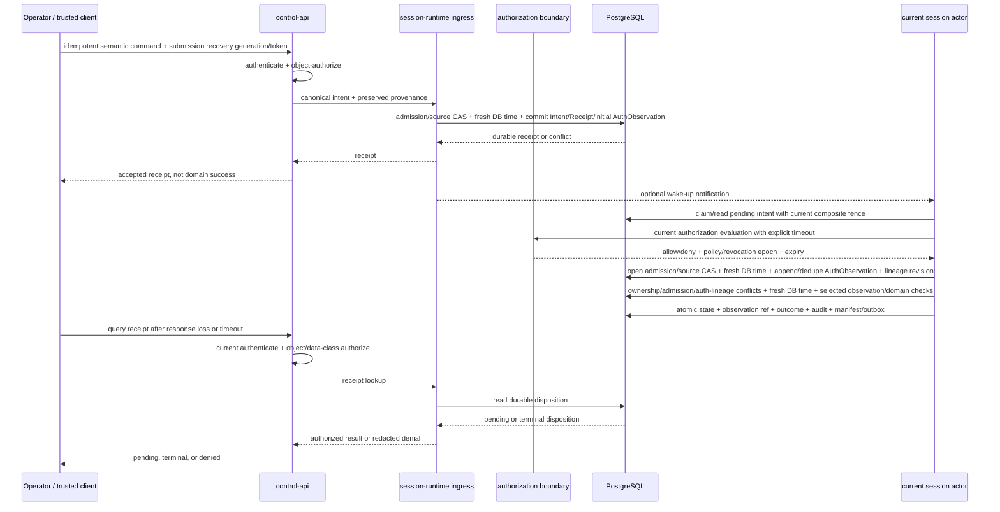
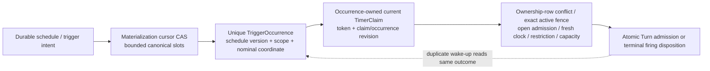

# Session Runtime Execution Model

Status: Proposed with ADR-003 and ADR-025; no runtime, contract, schema, migration, timer, or
provider implementation authorized

Governing sources:

- [ADR-003: stream-session, segment, and turn lifecycle](../adr/0003-stream-session-segment-and-turn-lifecycle.md)
- [ADR-004: PostgreSQL outbox and Redis Streams](../adr/0004-postgresql-outbox-and-redis-streams.md)
- [ADR-007: provider gateway and fallback isolation](../adr/0007-provider-gateway-and-fallback-isolation.md)
- [ADR-008: safety gate enforcement](../adr/0008-safety-gate-enforcement.md)
- [ADR-011: stage-host wire protocol and clock synchronization](../adr/0011-stage-host-wire-protocol-and-clock-synchronization.md)
- [ADR-015: layered emergency stop](../adr/0015-layered-emergency-stop.md)
- [ADR-019: authentication, authorization, and operator roles](../adr/0019-authentication-authorization-and-operator-roles.md)
- [ADR-020: mode transition and degradation matrix](../adr/0020-mode-transition-and-degradation-matrix.md)
- [ADR-023: event subject, scope, correlation, and ordering](../adr/0023-event-subject-scope-correlation-and-ordering.md)
- [ADR-024: versioned configuration and scoped activation](../adr/0024-versioned-configuration-and-scoped-activation.md)
- [ADR-025: session actor ownership, command ingress, and fencing](../adr/0025-session-actor-ownership-command-ingress-and-fencing.md)

## Purpose

This document makes the proposed session-runtime execution semantics reviewable before a schema
or worker exists. It explains how a stateless command API, one logical session actor, durable
timers, external providers, safety, media, and stage host compose without making process memory,
Redis, or a stale lease into authority.

The model is deliberately structural. It names no endpoint, table, column, ORM, queue product,
timer library, lease duration, retry count, provider, signing algorithm, or deployment topology.

## Authority Map

| Concern                                | Authoritative boundary                                                                               | Replaceable aid or observation                             |
| -------------------------------------- | ---------------------------------------------------------------------------------------------------- | ---------------------------------------------------------- |
| Session business state                 | PostgreSQL `StreamSession` aggregate and version                                                     | Actor memory, projections, Redis notifications             |
| Current logical actor                  | Protected recovery generation plus PostgreSQL `SessionOwnership` generation/phase/lease              | Runtime routing, orchestration placement, heartbeat        |
| Command acceptance and result          | Current recovery/source frontier plus PostgreSQL intent, receipt, and terminal outcome               | HTTP response, client cache, wake-up notification          |
| Trigger occurrence and firing          | PostgreSQL occurrence, claim, and firing disposition                                                 | In-memory timer wheel or scheduler wake-up                 |
| Provider/media/signing attempt lineage | PostgreSQL effect intent, send-authorized attempt, response observation, and application disposition | SDK request object, provider dashboard, transport response |
| Safety approval                        | `packages/safety` and its accepted durable approval lineage                                          | Actor state, provider moderation, operator UI              |
| Audience-task invalidation             | Session authorization epoch plus accepted signed contract                                            | Actor ownership generation or WebSocket connection         |
| Restrictive-control delivery           | PostgreSQL intent plus closed `session-runtime` dispatcher and exact stage-host acknowledgement      | Active actor, Redis wake-up, or transport acknowledgement  |
| Local acceptance/playout               | Stage-host durable journal and immediate local checks                                                | Cloud dispatch state or transport acknowledgement          |
| Domain-event history and publication   | PostgreSQL event/manifest/outbox records                                                             | Redis Streams and consumer offsets                         |
| Disaster recovery                      | Protected recovery generation plus reconciled authorities                                            | DNS, replica role, process placement, or cached health     |

## Ownership State Machine



The apparent `Active --> Recovering` takeover edge is one atomic replacement of the expired
owner, not a transition performed by the old actor. PostgreSQL time must prove that the old lease
expired, and the successor receives a new generation. At every point between expiry and
successful takeover, effective ownership is absent.

A vacant session cannot jump directly to ownership `closed`: when closure drain still needs a
writer, a successor acquires into `recovering`, finishes the fixed prefix, and performs the
atomic final-close transaction. An already committed final close has no vacant intermediate.

`recovering` has a restrictive capability set:

- read authoritative records;
- claim no ordinary command or timer for audience progression;
- classify and reconcile prior work;
- issue only separately typed, durable, bounded, source-bound, read-only or restrictive recovery
  probes;
- expire, cancel, quarantine, or fail-close stale work;
- persist known restrictions and recovery evidence; and
- advance the session authorization epoch when required.

It cannot mint approval, start an ordinary/widening external attempt, generate, synthesize, sign,
dispatch, resume, increase mode, or admit new scheduled audience work. A recovery probe has a
distinct four-role evidence lineage and cannot directly apply an audience/domain-advancing
result.

## Ordinary-Work Lease-Proof Rule

An actor has usable ownership proof for ordinary progression only when all of these are true:

```text
authenticated runtime process incarnation
  + exact environment/session
  + exact independently protected recovery generation
  + exact ownership generation and revision within that recovery generation
  + ownership phase = active
  + PostgreSQL lease is unexpired
  + conservative local monotonic mapping is still valid
  + remaining lease horizon covers the whole next external attempt
  -> eligible to evaluate all other domain preconditions
```

This proof is necessary, never sufficient. Safety, mode, emergency, rights, configuration,
capacity, authorization, aggregate version, and work deadline can still deny the operation.

A protected recovery/closure operation never borrows this ordinary-work proof. It instead proves
the operation-specific exact current fence: `active` plus immutable draining-prefix binding, or
`recovering` plus durable recovery-attempt/source binding; an unexpired lease and conservative
remaining horizon for any bounded recovery probe; and the exact non-widening operation class.
That proof can authorize only the closed classify/restrict/terminalize/probe set, never ordinary
eligibility.

The remaining-horizon rule prevents a normal lease expiry from overtaking a provider call that
was known to require longer than the lease. A forced administrative revoke can still race an
already send-authorized request; composite-fence-bound result application and downstream
session-epoch fencing contain that case.

Every protected commit and ownership transition shares one PostgreSQL linearization point on the
exact ownership row. After acquiring the incompatible row conflict, it takes a fresh database
clock reading, re-reads the composite fence/phase/owner/lease/revision, and holds the conflict
through commit. A predicate read or aggregate-row update alone is not a fence. The fixed lock
order is recovery-generation guard, ownership row, session aggregate, then dependent work rows.
No external call holds this transaction open.

## Normal Command Flow



The API response can be lost at every arrow. Correctness comes from these rules:

- no accepted response precedes the durable receipt;
- the receipt does not claim domain success;
- normal framing preserves the submission recovery generation/token across every retry;
- stale/unknown-generation or lost-tail receipt absence requires reconciliation, not fresh acceptance;
- a client timeout is `unknown` and is recovered with the same idempotency identity;
- same intent returns the first durable receipt/outcome only after current disclosure
  authorization;
- different digest under the same protected scope/key is a conflict;
- refreshed credentials for the same principal/semantic intent do not change its digest and may
  append a deduplicated authorization observation without overwriting earlier lineage only while
  the command is nonterminal, before its hard deadline, and under the exact open admission epoch/
  source CAS using fresh accepted database time obtained after the conflict;
- another principal has a distinct protected scope and cannot observe the first receipt;
- notification loss only delays processing;
- terminal state and command outcome commit together; and
- a stale actor cannot complete the command because its ownership predicate fails.

### Command Lifecycle

Exact serialized state names remain OD-021 work. The semantic lifecycle is:

| Stage                          | Durable meaning                                                                                     | Retry behavior                                                        |
| ------------------------------ | --------------------------------------------------------------------------------------------------- | --------------------------------------------------------------------- |
| Not durably received           | No receipt exists inside a proven-complete current recovery horizon                                 | Caller may submit the current-generation intent                       |
| Recovery/tail ambiguous        | Submission generation is stale/unknown or receipt absence lies in an unclosed tail                  | Reconciliation required; never reaccept as a fresh command            |
| Received/pending               | Intent, receipt, and initial auth observation exist; no terminal domain outcome                     | Current or successor owner may reauthorize and process                |
| Claimed/processing             | Optional bounded execution claim is tied to one composite actor fence                               | Stale claim expires; intent remains durable                           |
| Awaiting current authorization | Retryable stale/expired/step-up/unavailable evidence makes work ineligible without terminalizing it | Append a current observation before deadline; never mutate yet        |
| Effectively expired            | Hard deadline passed; terminal row may await writable authority                                     | Never executable; lookup reports expiry disposition pending           |
| Terminal success               | Domain transition and outcome committed atomically                                                  | Same intent returns the same outcome                                  |
| Terminal rejection             | Accepted policy classifies the denial nonretryable and durable reason is recorded                   | Later auth observations cannot reopen; changed intent needs a new key |
| Terminal failed-closed         | Required authority/evidence could not be established before the command deadline                    | Never widened into success                                            |
| Caller observation unknown     | Caller did not observe a receipt or outcome; this is not a durable command state                    | Query or retry the same identity                                      |

Every command has universal effective expiry: after its immutable hard deadline it is never
executable, even while the terminal write is unavailable. A current owner eventually commits
exactly one expired/failed-closed terminal disposition. Cancellation and supersession remain
taxonomy-specific. A general-purpose `failed` flag is insufficient.
Receipt acceptance, refreshed-observation append, ordinary claim/execution, and later
terminalization each compare that deadline with fresh accepted database time obtained after
their governing row conflicts. Process wall time cannot accept or revive work at the boundary.

The semantic digest excludes bearer tokens, transport sessions, token expiry, and volatile
authorization-evaluation artifacts. The receipt retains minimized original authorization
provenance separately. Every initial or refreshed `CommandAuthorizationObservation` is
append-only and binds the command/principal/digest, policy/revocation epoch, minimized
authentication context, decision, time, and expiry without a reusable credential. Execution
performs a current explicitly timed authorization evaluation and binds the selected unexpired
observation, current epoch, and expected per-command authorization-lineage revision into its
protected commit. Each append advances/CASes that revision; a concurrent append invalidates
execution. Selection follows the deterministic OD-022 precedence, and until it is accepted a
newer or incomparable allow/deny/step-up/unavailable observation fails closed instead of allowing
an older allow to be selected. A transient refresh cannot be reconstructed after failure, and an
old observation cannot outlive revocation or expiry.
Retryable authorization invalidation leaves the command visibly pending but ineligible until a
new observation or its hard deadline; an accepted nonretryable denial alone can terminalize it.
No authorization observation is appended after admission starts draining, a terminal outcome,
or effective expiry; receipt disclosure records a separate bounded access audit and can never
revive execution.
Possession of the key/receipt is not read capability. Every path returning an existing receipt
or outcome—including duplicate submission and lookup—independently performs current object- and
data-class disclosure authorization and may deny or redact after revocation.

### Session Closure And Admission Drain

Normal command receipt, durable viewer/platform/director/content-scheduler input promotion, timer
materialization/claim/firing, every turn admission, ordinary effect-intent creation/effect send
authorization/advancing effect application share one monotonic per-session admission
status/epoch. The same gate protects every other ordinary Turn/attempt/candidate/selection/
approval/media/task/signing/dispatch creation or advancement. Separately typed recovery probes
belong only to the bounded evidence exception below.

```text
open
  -> draining(normal_closure): ownership-protected begin-close + Ending/resolved target + committed-prefix cut
  -> draining(lost_tail_quarantine): new-generation recovery + Ending/proven-or-unresolved target + conservative affected interval
draining(normal_closure)
  -> draining(normal_closure + lost_tail_quarantine overlay): new-generation recovery strengthens an unproven drain/final-close tail
draining
  -> closed: resolved terminal target + every accepted prefix item terminal/safely classified + atomic final close
```

Every draining form carries a permanent reopen prohibition. The historical initial cause is
immutable; a lost-tail overlay can only strengthen it. The same quarantine transaction moves any
restored nonterminal session lifecycle to `Ending`, preserves only a terminal target proven
inside the trusted restore horizon, and otherwise binds the conceptual
`unresolved_lost_tail_target` marker. That marker is not an approved serialized value; OD-029/034
must define and resolve it. Lost-tail quarantine reaches final close only after accountable
target/tail disposition, exact rig/audience reconciliation, and safe classification or permanent
quarantine of every affected range; otherwise it remains `Ending`/`draining`. A restored atomic
`closed` session remains closed and ownerless.

Every normal source, turn-admission, effect-intent creation, effect-send-authorization, and
advancing effect-application transaction conflicts/CASes the same admission/source row. A race
winner before `draining` belongs to the fixed pre-close prefix; a later command gets no-lineage
`session_closed`, timer cursors freeze with one schedule-level closure disposition and no future
occurrence rows, raw observations cannot become eligible triggers/turns, and no
post-begin-close-cut ordinary effect intent/send/application can grow or advance normal work.
During `draining`, the active actor or recovery-only successor terminalizes the prefix in bounded
batches. Every input promotion, turn admission, timer claim/firing, ordinary effect intent/send
authorization, and advancing effect application revalidates the exact open admission epoch. A
bounded late response observation may still record evidence for a pre-closure-cut attempt; a
prior send-authorized attempt remains possibly sent until safely classified, and drain may
persist only non-advancing expiry/cancellation/rejection/quarantine dispositions. A separately
typed recovery-probe lineage may be created only for one fixed-prefix/lost-tail ambiguity, under
the exact active-draining or recovering binding, and can end only in a non-widening disposition.

No omitted session pipeline stage is an exception: once admission is non-open, provider/safety
observations may be recorded only as bounded evidence, while candidate creation, selection,
approval minting, media authorization, task creation, signing, dispatch, and any other ordinary
domain/audience progression are rejected. Restrictive actions and terminal/non-advancing
expiry/cancellation/rejection/fail-closed/quarantine dispositions remain available.

Final close takes the recovery guard, ownership, session, and admission/source rows in fixed
order; compares the exact draining epoch/fixed prefix; proves the lifecycle is `Ending`, its
terminal target is resolved, all pre-close input, command, occurrence, turn, and effect state is
terminal/safely classified, every admitted recovery-probe lineage is terminal/non-widening, and
no bound source ambiguity remains unresolved (it is resolved, permanently safe-quarantined, or
accountably disposed) and no audience ambiguity remains; and atomically commits that resolved
session terminality, drain evidence, admission `closed`, ownership-generation increment,
owner/lease clear, and ownership `closed`. A terminal probe may truthfully say `unknown`; closure
depends on the separate source classification, not relabeling evidence. A crash before commit
leaves `Ending`/`draining`; a successor may acquire only to recover/close. A crash after commit
sees every terminal fact together. Revoke/relinquish racing final close serializes on the
ownership row and cannot create a reopen path.

OD-021 owns the wire framing/status for deterministic `session_closed` non-acceptance. The
post-closure-cut request creates no command intent, receipt, outcome, or authorization observation; a
separately bounded access/abuse audit may be recorded. Authenticated stop remains available
through the separate safe-direction path.

## External-Effect Flow

This diagram is the ordinary active/open flow. A recovery probe uses the distinct bounded
four-role lineage below and has no advancing branch.

```mermaid
sequenceDiagram
    participant A as active actor
    participant DB as PostgreSQL
    participant G as provider/media/signing gateway

    A->>DB: ownership/admission conflicts + fresh time; commit immutable EffectIntent
    A->>DB: ownership/admission conflicts + fresh time; commit send-authorized EffectAttempt
    DB-->>A: durable attempt allocation
    Note over A,G: crash from here is possibly sent, even before the first byte
    A->>G: one bounded attempt with stable idempotency identity
    G-->>A: success, failure, timeout, or indeterminate
    A->>DB: bounded lineage-validated evidence-only EffectResponseObservation
    Note over A,DB: response-before-observation crash remains possibly sent / unknown
    A->>DB: ownership/admission conflicts; apply with current active fence + open epoch + domain checks
    alt ownership or eligibility changed
        DB-->>A: reject application
        A->>DB: commit non-advancing EffectApplicationDisposition
    else still current
        DB-->>A: atomically commit advancing disposition + domain transition
    end
```

The intent, send authorization, possible send, response observation, and application are
separate crash boundaries. `EffectAttempt` proves only that a send was authorized; it does not
prove that a byte left the process or that the provider accepted it. Recovery classifies each
intent:

| Classification                                      | Successor behavior                                                                                                                                   |
| --------------------------------------------------- | ---------------------------------------------------------------------------------------------------------------------------------------------------- |
| No attempt in proven-complete same-recovery horizon | Only after activation and exact-open admission, revalidate and allocate the first ordinary attempt using the same stable intent/idempotency identity |
| Attempt may lie in lost/unknown recovery tail       | Treat as possibly sent; quarantine or reconcile, never infer absence/replay                                                                          |
| Attempt exists; idempotency supported               | Retry/query only under reviewed downstream semantics and the original identity                                                                       |
| Attempt exists; outcome queryable                   | Use a bounded recovery probe; query timeout remains unknown                                                                                          |
| Possibly sent; unknown/non-idempotent               | Wait for the bounded horizon or fail-close the work; do not blind-replay                                                                             |
| Response durably observed, not yet applied          | Apply only if current active composite fence, open admission epoch, aggregate, deadline, and restrictions still permit                               |
| Late, stale, expired, or superseded                 | Commit a non-advancing disposition; never re-enter the active turn                                                                                   |
| Audience-bound dispatch ambiguous                   | Rotate session authorization epoch, evict old work, reconcile the exact rig, remain in recovery hold                                                 |

An intent's immutable composite fence is creation provenance, not continuing authority. A
successor can allocate an attempt against that stable intent only after the closed recovery
classification proves it eligible and the new attempt revalidates every current authority under
the successor's exact composite fence.

Provider cost may be incurred by an old request after revoke. The safety property is that its
result cannot become approval, media, or audience output without a new current chain.

One logical domain-provider operation (`GenerationAttempt`, `SynthesisAttempt`, signing,
transfer, or dispatch lineage) owns one effect intent. Transport replay under one reviewed
idempotency identity creates another send-authorized effect attempt; policy retry, fallback,
rewrite, provider change, or semantic request change creates a new domain attempt and intent.
Every response observation belongs to one attempt and has at most one terminal application
disposition. At most one observation per intent can advance authority/domain state.

A recovery probe uses a logically distinct four-role
`RecoveryProbeIntent`/`Attempt`/`ResponseObservation`/`Disposition` lineage; OD-034 must decide
whether physical storage is separate or uses a protected discriminator. Admission requires
either the exact active fence plus one immutable draining-prefix item, or the exact recovering
fence plus one durable recovery attempt/source ambiguity. Its intent transaction shares the
ownership-row conflict and fresh database time, proves a reviewed allowlisted read-only or
restrictive operation, binds an unextended deadline/stable idempotency identity, and consumes
finite OD-037 attempt/count/byte/rate/age/concurrency capacity.

An intent owns zero or more bounded attempts; each attempt commits before the first possible byte,
each received response is observed before disposition, and the intent gets exactly one terminal
non-widening disposition. Zero-attempt expired/cancelled/superseded/failed-closed-before-send
dispositions are valid. The originating fence/source binding is provenance, not continuing
authority: after crash, lease expiry, phase change, or takeover, an exact current
active-draining/recovering successor bound to the same source ambiguity may append bounded
evidence and terminalize stale/unknown/quarantined, but cannot send on the old intent. Another
query requires a newly admitted bounded intent.

Probe evidence and source classification remain separate. Timeout, contradiction, or
non-authoritative negative evidence may terminalize the probe as `unknown` and cannot prove
absence or authorize replay; the bound ambiguity must separately be resolved, permanently
safe-quarantined, or accountably disposed. Every recovery-attempt-bound probe write advances
the recovery invalidation/source revision. Activation requires all such probe intents terminal
and each bound ambiguity resolved for the enabled scope or held behind an explicit capability
disable; otherwise its CAS rejects. Provider outcome queries and sealed stage-host state/hold
reconciliation qualify only after protected review. Generation, synthesis, signing, dispatch,
resume, mode increase, new normal lineage, and advancing application never qualify. A closed
session admits no probe.

## Timer And Trigger Flow



An in-memory timer can say only "look now." PostgreSQL determines whether the occurrence exists,
is due, is unclaimed or reclaimable, is before its deadline, and has already admitted a turn.

Periodic work derives one canonical occurrence key from exact environment/session, schedule
version, scope, and the schedule-defined nominal ordinal/window. A uniqueness invariant plus
materialization-cursor CAS prevents concurrent evaluators from allocating two identities or
skipping a slot after commit-response loss. Materialization ranges are bounded under OD-037; an
allocated sequence/timestamp maximum is not a completeness frontier. The materialization
transaction first takes the shared ownership-row conflict, fresh accepted database time, and the
exact active composite actor fence, then CASes the exact open admission/source epoch and cursor
with the committed occurrence set. A recovering owner may classify existing rows for the closed
recovery barrier but cannot create occurrences or advance the cursor; a stale owner loses at the
ownership row.

A claim-acquisition transaction takes the ownership-row linearization point and fresh database
time, proves the exact active composite actor fence plus exact open admission/source epoch, then
compare-and-swaps expected occurrence revision plus expected current-claim revision to one new
token/revision. A concurrent loser reads the winning claim or terminal disposition; unique tokens
alone cannot make two claims current. A firing transaction repeats the exact active-fence/open-
admission/time proof and validates that same unexpired current token, claim revision, and
occurrence revision. A reclaim uses the same CAS and supersedes an older claim even when both
claims belong to the same composite actor fence. If closure wins, no new/current claim may form
and a prior claim can commit only the fixed-prefix terminal non-admitted disposition. Takeover
reuses the canonical occurrence. It never turns missed wall-clock intervals into anonymous new
triggers.

Until OD-014 approves a family policy:

- missed occurrences do not catch up autonomously;
- sponsor, legal, rights-sensitive, or deadline-sensitive work does not shift itself later;
- no queue drains an unbounded historical backlog; and
- uncertainty yields expiry, operator disposition, or safe omission rather than burst output.

## Takeover Reconciliation Checklist

The successor cannot enter `active` until it records a complete disposition for every applicable
row:

| Area                   | Required reconciliation                                                                                                                                                                 |
| ---------------------- | --------------------------------------------------------------------------------------------------------------------------------------------------------------------------------------- |
| Ownership              | Exact recovery/ownership composite fence and lease proven; prior owner fenced                                                                                                           |
| Session                | Lifecycle, aggregate version, normal-work admission status/epoch and drain prefix, requested/effective mode, emergency latch, deadlines, and terminality current                        |
| Configuration          | Exact resolved snapshot, activation/eligibility epochs, and current restrictive changes revalidated                                                                                     |
| Authorization/presence | Command authorization horizons, operator presence, confirmation challenges, and revocations current                                                                                     |
| Safety/rights/surfaces | Approval, approved-content availability, rights, surface, expiry, and restriction state proven                                                                                          |
| Commands               | Every receipt/auth-observation/outcome classified; if admission drains, every pre-close command is terminal and no later command is pending                                             |
| Effects                | Every pre-frontier intent/attempt/observation/disposition classified; no unknown non-idempotent effect replayed                                                                         |
| Recovery probes        | Every recovery-attempt-bound probe intent terminal/non-widening; originating fence is provenance; bound ambiguity resolved for enabled scope or held behind explicit capability disable |
| Timers                 | Every due occurrence pending, admitted once, expired, skipped, or terminally disposed                                                                                                   |
| Media/dispatch         | Signing, transfer, dispatch, acknowledgement, and possible playout classified                                                                                                           |
| Stage host             | Exact rig/boot/connection/binding/epoch/latch/queue/journal/clock/adapter reconciled under a sealed recovery hold                                                                       |
| Restrictions           | Durable and `uncommitted_restrictive` evidence applied in strongest valid direction                                                                                                     |
| Events/outbox          | Committed state/manifest/outbox coherence proven without treating publication as state authority                                                                                        |
| Capacity               | Protected reserves, queue bounds, retry budgets, and recovery-drain limits available                                                                                                    |

Any unknown row keeps the relevant capability disabled. The successor may become active for a
strictly narrower capability set only when ADR-020 and the accepted recovery policy model that
scope explicitly; it cannot infer partial safety from absence of evidence.

### Closed Activation Barrier

A final scan is not an activation fence. Each recovery attempt durably fixes:

- the exact composite actor fence and ownership revision;
- exact normal-work admission status/epoch and any fixed pre-close drain prefix;
- source-serialized gapless committed-prefix manifests or an equivalent commit-time partition for
  command inbox and timer materialization, including schedule cursors;
- every later normal row as explicit `post_cut_pending`, unclaimable until activation;
- a monotonic invalidation revision covering changed pre-frontier classifications and every new
  restrictive or ambiguity-bearing effect/dispatch/authorization/stage-host fact plus every
  recovery-probe intent/attempt/observation/disposition write bound to the attempt;
- all recovery-attempt-bound recovery-probe intents terminal and their source ambiguities resolved for the
  enabled scope or held behind an explicit capability disable;
- completed dispositions and exact configuration, safety, rights, clock, and capacity versions;
  and
- an authenticated sealed stage-host boot/binding/epoch/journal cursor and restrictive-hold
  receipt.

Every source write serializes through its recovery-cut row so its own commit is classified
pre-cut or post-cut. A write that changes a pre-cut classification or adds restrictive or
ambiguity-bearing evidence advances the recovery-invalidation revision in the same transaction.
A harmless post-cut normal write receives its durable `post_cut_pending` tag and may advance a
separate post-cut operational cursor that is not an activation-CAS input. The final
`recovering -> active` transaction takes the shared ownership-row linearization point and
compare-and-swaps the fixed source frontiers plus exact invalidation and authority revisions.
Any relevant change rejects activation; harmless post-cut ingress does not. A stage host in
sealed recovery hold accepts no audience work; it leaves that hold only through a later
authenticated activation/binding step for the exact accepted epoch. Unknown or unsealed peers
keep their capability disabled. Ordinary activation also requires the admission gate to remain
`open`; a `draining` recovery finishes bounded terminalization/closure and `closed` remains
terminal.

An allocated ID, sequence maximum, or timestamp maximum is never a recovery frontier. Source
commits serialize through the recovery-cut row, so a transaction that reserved an ID before the
cut but commits afterward is classified post-cut or invalidates the attempt. Harmless post-cut
normal ingress can remain pending without starving activation; any new restrictive or
ambiguity-bearing fact always invalidates it.

## Audience-Bound Transfer

The composite recovery/ownership fence protects cloud execution. Session authorization epoch
and the accepted rig binding/signing authority fence work already capable of reaching stage
host. Both layers are required:

```text
old actor loses the composite actor fence -> old actor cannot commit/sign/dispatch

administrative revoke with possible escaped work
  -> same transaction rotates restrictive session fence + installs control/hold intent
  -> audience convergence remains unknown until exact stage-host acknowledgement

expiry, crash, or unclean takeover
  -> successor enters recovering
  -> any task/widening-control/playout ambiguity advances session authorization epoch
  -> stage host evicts old-epoch work and returns a sealed reconciliation receipt

clean pre-broadcast relinquish
  -> epoch may be retained only when the accepted protocol proves no work escaped

all branches
  -> activate only after the closed recovery barrier
  -> dispatch only fresh work under the accepted current epoch/binding
```

A session epoch advance does not cancel a provider request by itself. Composite-fence and
result-eligibility checks do that. Likewise, an ownership generation change does not tell a
disconnected rig to discard a task; the signed session epoch and ADR-011/015 reconciliation do
that.

Administrative revoke atomically removes cloud ownership and, whenever escaped audience work is
possible, advances the session epoch or stronger reviewed downstream fence, installs a durable
dispatch/recovery hold, and creates priority restrictive-control intent. It immediately attempts
restriction at every reachable boundary. Because no active actor remains, a closed
`session-runtime` restrictive-control dispatcher drains the PostgreSQL intent with bounded
claims/retries, current recovery generation/latest restrictive epoch/exact rig validation,
priority reserve, explicit timeout, and durable acknowledgement. It has no normal mutation,
resume, mode-increase, approval, or `SpeechTask` authority. A database pre-send check cannot
order a later network send against revoke, so OD-021 must define a downstream-verifiable
task-versus-restriction ordering rule. Until stage host acknowledges the newer restriction,
cloud revoke does not claim audience cessation; immediate cessation uses ADR-015 local e-stop.

After PITR/failover, a repeated ownership or session-epoch number is never trusted by itself. The
cloud composite fence uses an independently retained/rebased recovery generation. The audience
path must additionally validate that recovery generation or establish a superseding rig
binding/signing authority and epoch above a trusted high-water before serving.

The new recovery generation fences stale authority but does not restore a database tail lost
under nonzero or unknown RPO. Only accepted zero-loss WAL/quorum/commit attestation closes
authoritative PostgreSQL history. Otherwise absence of a normal-work admission/close cut, command
receipt, effect attempt, timer occurrence, dispatch, or restriction is `lost_tail_unknown`, never
proof of nonoccurrence. A non-rollback deny-only ledger may prove existence, narrow quarantine
scope, and strengthen denial; it cannot prove absence or reconstruct/authorize a missing
PostgreSQL fact. A restored `open` admission state with an unproven later tail is atomically
superseded in the new recovery generation by `draining(lost_tail_quarantine)` with a visible
trusted high-water/unproven interval, affected source set, restrictive holds, reopen prohibition,
and lifecycle transition to `Ending`; only a terminal target proven inside the trusted horizon is
preserved, otherwise the target remains explicitly unresolved. A restored
`draining(normal_closure)` preserves its historical cause/fixed prefix but receives the monotonic
lost-tail overlay and the same stronger close gate. A restored atomic `closed` session remains
closed while later unknown-tail/restrictive evidence is recorded separately. No case permits a
command, timer, turn, actor reacquisition for a closed session, or same-session reopen. Affected
old-generation commands are not silently reaccepted, effects are not replayed, timer slots are
not autonomously rematerialized/caught up, and audience scope remains disabled pending bounded
reconciliation and accountable disposition.

## Safe-Direction Bypass

The normal command/ownership path is intentionally bypassable only in the restrictive direction:

| Operation under uncertainty                     | Permitted? | Claim allowed                                                 |
| ----------------------------------------------- | ---------- | ------------------------------------------------------------- |
| Local hard stop / watchdog restriction          | Yes        | Local effect and buffered evidence only                       |
| Process-local cloud freeze / admission denial   | Yes        | `uncommitted_restrictive`; no durable aggregate-success claim |
| Mode decrease or cancellation                   | Yes        | Restrictive effect; reconcile before any later widening       |
| Approval, synthesis, signing, or dispatch       | No         | None                                                          |
| Resume, clear, mode increase, or fallback widen | No         | None                                                          |
| Command acceptance without PostgreSQL receipt   | No         | Caller outcome remains unknown                                |

Stop authority remains available even if no actor is current. Resume authority always requires a
current recovered owner plus every ADR-015/019/020 precondition. An authenticated stop assertion
cannot be rejected because it reports an older session epoch; an epoch only prevents stale
widening or lowering a newer restriction. Each reachable boundary restricts immediately, while
an unreachable peer remains unknown and prevents any global convergence/success claim.

## Failure-Containment Matrix

| Boundary fault                           | Containment proof                                                                                                                                               |
| ---------------------------------------- | --------------------------------------------------------------------------------------------------------------------------------------------------------------- |
| Runtime pause longer than lease          | Resume path revalidates; stale composite fence fails every commit/effect boundary                                                                               |
| Commit waits behind revoke/takeover      | Shared ownership-row conflict forces a post-wait re-read and rejection                                                                                          |
| Runtime-to-database partition            | No renew, normal commit, accepted receipt, timer firing, or widening effect                                                                                     |
| Database response lost                   | Transition outcome is unknown; exact read/CAS/idempotency recovers it                                                                                           |
| Ingress-to-actor notification lost       | Durable pending receipt remains discoverable                                                                                                                    |
| Duplicate command delivery               | Canonical intent/idempotency returns one terminal outcome                                                                                                       |
| Receipt races begin-close                | Shared admission/source CAS includes it in pre-close drain or returns no-lineage `session_closed`; no post-begin-close pending lineage                          |
| Actor crashes during close drain         | Admission stays non-open; successor terminalizes fixed prefix and closes without reopening                                                                      |
| Command deadline passes while unwritable | It is immediately ineligible; later authority records one terminal expired/failed-closed outcome                                                                |
| Provider response arrives late           | Composite-fence/deadline/current-state transaction rejects application                                                                                          |
| Crash after send authorization           | Attempt is possibly sent until reviewed downstream evidence proves otherwise                                                                                    |
| Crash after response, before observe     | Response remains unknown; process memory cannot manufacture a durable observation                                                                               |
| Takeover during possible dispatch        | Restrictive hold/epoch and sealed stage-host reconciliation prevent resumption                                                                                  |
| Administrative revoke races dispatch     | Cloud authority ends atomically; audience convergence remains unknown until downstream fence/ack                                                                |
| Recovery evidence changes at activate    | High-water/invalidation compare-and-swap fails and recovery repeats                                                                                             |
| ID reserved before cut, commit after     | Commit-time source serialization marks it post-cut or invalidates activation                                                                                    |
| PITR reuses a local generation number    | Independently protected recovery generation keeps the composite fence distinct                                                                                  |
| PITR loses a committed tail              | Affected range is unknown; no absence inference, reacceptance, replay, or catch-up                                                                              |
| Timer materialization races              | Ownership-row/current-active-fence proof plus canonical key/admission/cursor CAS returns one occurrence per nominal slot; recovering/stale owners cannot create |
| Expired timer claim fires after reclaim  | Current claim token/revision and occurrence CAS reject it                                                                                                       |
| Clock confidence lost                    | No lease extension, autonomous due decision, deadline extension, or upward recovery                                                                             |
| Redis lost                               | Ownership, command, timer, effect, state, and outbox authority remain in PostgreSQL                                                                             |
| Stage host disconnected                  | Cloud cannot infer playout; local watchdog/latch and reconnect reconciliation govern                                                                            |
| Safe-direction persistence lost          | Restriction acts locally/process-locally; widening stays blocked until durable reconciliation                                                                   |

## Review And Test Matrix

Reviewers should require a deterministic fault-injection grid over:

- every ownership phase and legal/illegal transition;
- actor A/actor B races with each possible PostgreSQL transaction order, ownership-row conflict,
  post-lock time sample, and fixed lock order;
- process pause immediately before and after ownership check, command receipt/initial
  authorization observation, refreshed-observation append/deduplication, authorization-lineage
  revision CAS, command claim/execution/terminalization, ordinary effect intent, send-authorized
  attempt, first possible send byte, response receipt, response-observation commit, application
  commit, signing, dispatch, and acknowledgement;
- database commit with response loss at receipt, refreshed authorization append, aggregate
  transition, timer materialization/claim/firing disposition, ownership renewal, revoke, and
  takeover;
- explicit revoke during each external attempt type;
- same-protected-scope/key/same-intent, refreshed-auth same-intent, cross-principal isolation,
  and same-protected-scope/key/different-intent command delivery, plus concurrent authorization
  append/execution,
  deterministic precedence, older/incomparable-allow rejection, and exact database-time deadline
  boundaries;
- every command receipt/refresh/claim/execution, viewer/platform/director/content-scheduler input,
  timer/Turn, ordinary effect intent/send/application, and ordinary candidate/approval/media/task/
  dispatch progression versus begin-close ordering; raw-input non-promotion; cursor freeze/no
  occurrence growth; bounded late evidence/terminal non-advancing drain; final-close versus
  revoke/relinquish/takeover; crash recovery; post-closure-cut submission; and stop-after-close;
- stale authorization, presence, mode, rights, activation, safety, session, rig, and recovery
  generations independently;
- timer canonical-key/materialization-cursor races, current-active ownership fence,
  stale/recovering-owner materialization rejection, current-claim-pointer acquisition/reclaim CAS
  with same-actor concurrent polls, commit-response loss, due-window boundary, clock uncertainty,
  expired-claim/reclaim races, one terminal firing disposition, missed occurrence, takeover, and
  bounded materialization/backlog;
- provider idempotent, queryable, non-idempotent, timeout, cancellation, and late-result profiles,
  including multiple attempts/observations for one intent and retry/rewrite/fallback/provider/
  semantic changes;
- recovery probes under exact active-draining-prefix and recovering-attempt bindings, covering
  intent/attempt/response/disposition crash cuts, idempotency, wrong binding, finite
  count/byte/rate/age bounds, negative/timeout/contradictory evidence, and proof that ordinary
  send/application remains blocked and no probe widens, proves absence, or authorizes replay;
- connected, disconnected, rebooted, sealed-recovery, old-epoch, post-PITR old-binding, and
  `playing_or_in_doubt` stage-host states;
- recovery-input arrival immediately before activation, preallocated-ID late commit/commit
  reorder, immutable cut-time source/cursor snapshots, harmless post-cut ingress continuously
  advancing only the excluded operational cursor without activation starvation, and
  ambiguity/restrictive evidence advancing invalidation immediately after each captured source
  frontier;
- PITR with lost admission/close-cut/command/effect/timer/restriction tails across restored
  `open`, `draining(normal_closure)`, and atomic `closed`; lifecycle/admission-axis coherence;
  monotonic lost-tail overlay; unresolved-target blocking; forced non-open admission; and old
  receipt/idempotency retries;
- safe-direction actuation with database, audit, identity-provider, transport, and current actor
  independently unavailable.

Properties to prove include:

1. at most one composite actor fence can make an ordinary session transition;
2. no stale composite fence can start a known-over-lease-budget effect or apply any result;
3. every durably accepted normal command reaches one durable terminal disposition or remains
   visibly pending before its explicit deadline, becomes permanently ineligible at deadline, and
   cannot execute after a concurrent authorization-lineage change or by selecting an older/
   incomparable allow;
4. no ambiguous client response is reported as success;
5. one canonical nominal trigger slot materializes one occurrence, admits at most one turn, and
   receives at most one terminal firing disposition;
6. one effect intent has at most one authority/domain-advancing observation, every observation
   has at most one disposition, and retry/rewrite/fallback/provider/semantic change creates a
   new domain attempt and intent;
7. every recovery-probe lineage is separately typed, source-bound, bounded, and terminal before
   final close; it has no authority/domain-advancing disposition;
8. no takeover replays a send-authorized/possibly-sent non-idempotent effect automatically;
9. no terminal turn, command, occurrence, task, or session (`ended`, `cancelled`, or `failed`) is
   reopened, and every terminal session value commits only with atomic admission/ownership close;
10. after begin-close makes admission non-open, no command/input/timer/Turn/ordinary-effect/candidate/
    approval/media/task/signing/dispatch path creates or advances ordinary work; only bounded
    evidence—including the typed recovery-probe exception—restrictive action, and terminal
    non-advancing drain remain available;
11. every deadline can stay equal or shorten, never extend;
12. any ownership, recovery-generation, audience-fence, or clock uncertainty reduces capability;
13. no recovery activation can pass with changed bound immutable frontiers/invalidation
    revisions or an unsealed peer, while harmless post-cut operational-cursor progress alone
    cannot starve an otherwise valid activation;
14. administrative revoke never claims audience cessation before downstream convergence;
15. no lost authoritative tail is inferred absent or replayed automatically; lost-tail
    quarantine keeps lifecycle/admission axes coherent and cannot final-close an unresolved
    terminal target; and
16. safe-direction actions remain available without conferring widening authority.

## Implementation Gate And OPEN Scope

This model grants no implementation authority. ADR-025's schema and implementation gate applies
in full. In particular:

- OD-014 retains trigger taxonomy, retry/interruption, missed-occurrence/catch-up, and
  pre-close drain/terminal-disposition policy;
- OD-021 retains the protected idempotency-key scope, semantic-digest exclusion from lookup
  identity, same-protected-scope/key/same-digest original-record reuse,
  same-protected-scope/key/different-digest conflict with no second lineage, serialized
  command/receipt/outcome/no-lineage `session_closed` response, task, control, acknowledgement,
  reconciliation, and canonicalization/digest rules;
- OD-022 retains command principal/source capability, receipt disclosure, append-only
  authorization observation, retryable/nonretryable denial, revocation, presence, and step-up
  semantics;
- OD-029 retains independently protected non-rollback recovery generation/high-water authority,
  same-site PITR and cross-site failover/failback completeness, lost-tail proof/ledger and
  disposition, restored-open/draining/closed lifecycle/admission coherence, monotonic quarantine
  overlay, accountable unresolved-target resolution, and restored
  session-epoch/signing/rig-binding supersession;
- OD-033 retains domain-event classification and catalog mappings;
- OD-034 retains physical records, constraints, access, retention, and migration scope;
- OD-035 retains every numeric lease, timeout, margin, horizon, and clock value; and
- OD-037 retains queue, claim, fairness, reserve, retry, poll, scan, and drain bounds.

No example state name in this document may be copied into a production schema or API without the
accepted ADR, contract, lifecycle, and migration reviews that own that surface.
