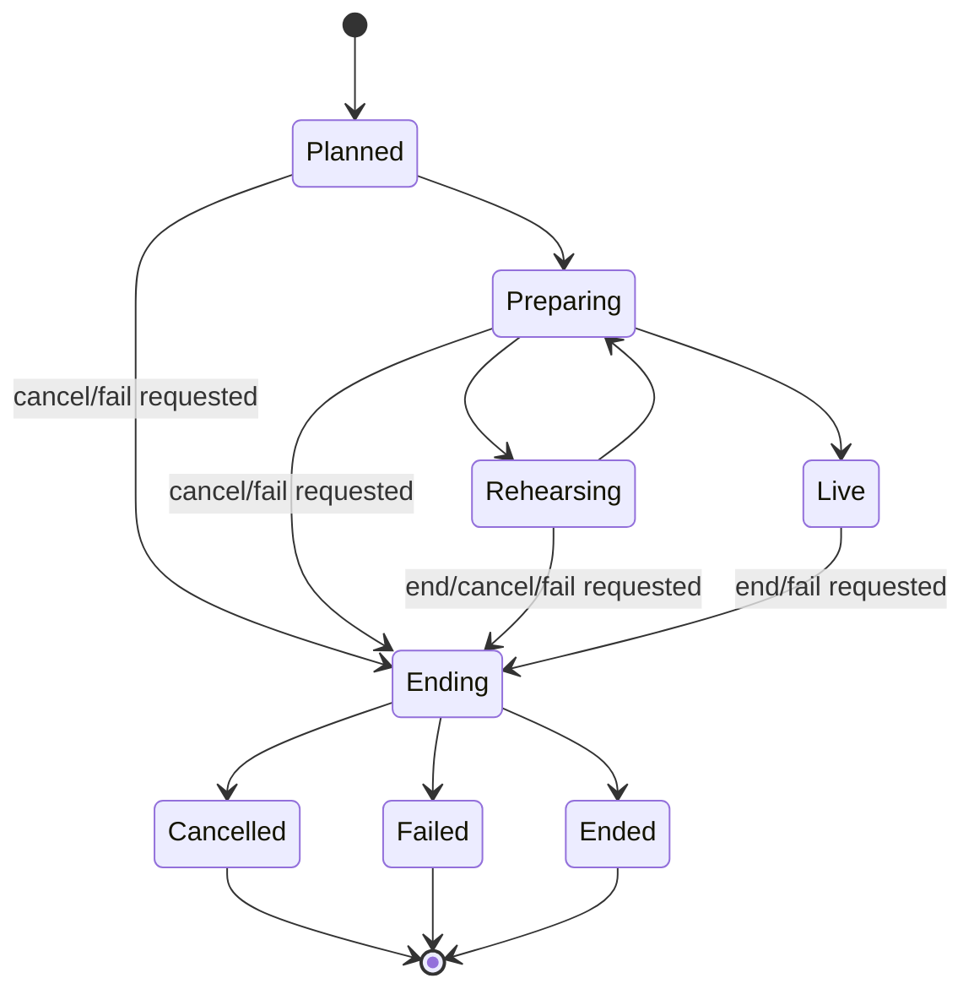

# Session And Turn State Model

Status: Proposed with ADR-003 and ADR-025; no runtime, contract, timer, or database
implementation authorized

## Orthogonal Session State

`StreamSession` does not use one oversized enum. These axes change independently and are evaluated together:

| Axis                    | Purpose                                                          | Owned by    |
| ----------------------- | ---------------------------------------------------------------- | ----------- |
| `session_lifecycle`     | planned, rehearsal/live activation, ending, and terminal closure | ADR-003     |
| `normal_work_admission` | monotonic open, draining, and closed source/admission epoch      | ADR-025     |
| `requested_mode`        | operator-requested autonomy ceiling                              | ADR-020     |
| `effective_mode`        | policy- and health-constrained actual mode                       | ADR-020     |
| `emergency_latch`       | dominant stopped/resume-required condition                       | ADR-015     |
| `rig_connection`        | stage-host binding, heartbeat, degraded, or disconnected state   | ADR-011/016 |

The effective permission to generate, approve, dispatch, or play is computed from all axes. No individual enum value implies that speech is safe.

Actor ownership is deliberately not another `StreamSession` business-state enum. The
protected recovery generation plus PostgreSQL-authoritative ownership generation and
`vacant`/`recovering`/`active`/`closed` coordination phase are governed by ADR-025. Every normal
transition below additionally uses the shared ownership-row conflict and post-conflict database
time to prove the exact active composite actor fence and unexpired lease. A separately typed
read-only/restrictive recovery probe requires either exact active+draining-prefix binding or exact
recovering+recovery-attempt/source binding; the latter ownership may also expire, cancel,
quarantine, and restrict work but cannot advance it. A current successor may terminalize an
old-fence probe non-wideningly while preserving the originating fence as provenance.

Normal-work admission is coordination authority distinct from lifecycle, actor ownership, and
audience authorization. Its exact open epoch gates every normal input/command/timer/Turn
admission plus every ordinary attempt/candidate/approval/media/task/effect/signing/dispatch
progression; begin-close cuts and drains a fixed prefix, permits only bounded evidence/
restrictive/terminal non-advancing writes, and neither `draining` nor `closed` can reopen. A
restored `draining(normal_closure)` state with an unproven later tail preserves its initial cause
and receives a monotonic lost-tail quarantine overlay; a restored `closed` state remains closed.

Each admitted turn also pins the exact `ResolvedConfigurationSnapshot` proposed by ADR-024.
Configuration is not another mutable session enum: current activation changes do not rewrite an
in-flight or completed turn. The snapshot records exact activation and definition/set eligibility
epochs; protected enforcement points compare them with current restrictive state. A restrictive
authority may hold, cancel, or require revalidation under the accepted family policy, but it
never silently swaps versions or permits a withdrawn input through a stale snapshot.

## Session Lifecycle

`Ending` durably carries the closure cause and either a resolved requested terminal target or the
explicit conceptual marker `unresolved_lost_tail_target`. Normal begin-close binds the resolved
target. A lost-tail quarantine transaction atomically moves any restored nonterminal lifecycle
to `Ending`, preserves a target only when it is proven inside the trusted restore horizon, and
otherwise binds that unresolved marker; it never takes a direct nonterminal-to-terminal edge.
The marker is not an approved serialized enum or field—OD-029/034 must define its physical
representation and accountable resolution.

`Ended`, `Cancelled`, and `Failed` are committed only by ADR-025's one final-close transaction
after the admission gate is `draining`, the terminal target is resolved, and the fixed prefix is
terminal or safely classified. It also requires every admitted recovery probe terminal/
non-widening and each bound source ambiguity resolved, permanently safe-quarantined, or
accountably disposed; a terminal probe may remain truthfully `unknown`. That transaction
atomically commits the terminal lifecycle value, drain evidence, admission `closed`,
ownership-generation advance, owner/lease clear, and ownership `closed`; there is no earlier
terminal lifecycle row with an active or vacant ownership gap. A crash before it commits remains
`Ending`/`draining` for a recovery-only successor to finish, and a crash after it commits sees
every terminal fact.

Emergency stop does not move the lifecycle by itself; it latches independent emergency state and
prevents prohibited work.

## Turn Lifecycle

| Phase               | Meaning                                                             | Permitted next phases                                                                              |
| ------------------- | ------------------------------------------------------------------- | -------------------------------------------------------------------------------------------------- |
| `created`           | Trigger and policy provenance persisted                             | `screening`, `cancelled`, `expired`                                                                |
| `screening`         | Input/surface moderation and eligibility                            | `scheduled`, `rejected`, `failed_closed`, `expired`                                                |
| `scheduled`         | Eligible and waiting for actor/scheduler capacity                   | `generating`, `cancelled`, `expired`                                                               |
| `generating`        | Provider-neutral generation attempt active                          | `generating`, `evaluating`, `failed_closed`, `cancelled`, `expired`                                |
| `evaluating`        | Candidate safety evaluation active                                  | `generating`, `awaiting_operator`, `approved`, `rejected`, `failed_closed`, `cancelled`, `expired` |
| `awaiting_operator` | Mode/policy requires an operator to complete the terminal decision  | `generating`, `approved`, `rejected`, `cancelled`, `expired`                                       |
| `approved`          | ApprovedResponse exists and remains unexpired                       | `media_pending`, `cancelled`, `expired`                                                            |
| `media_pending`     | Identifier-only synthesis/media work active                         | `dispatch_ready`, `failed_closed`, `cancelled`, `expired`                                          |
| `dispatch_ready`    | Signed, integrity-bound task can be dispatched                      | `dispatched`, `cancelled`, `expired`                                                               |
| `dispatched`        | Stage-host accepted current-epoch work                              | `playing`, `cancelled`, `expired`, `failed_closed`                                                 |
| `playing`           | Local playout active                                                | `completed`, `cancelled`, `failed_closed`                                                          |
| terminal            | `completed`, `rejected`, `expired`, `cancelled`, or `failed_closed` | none                                                                                               |

`generating -> generating` records a failed or cancelled `GenerationAttempt` and starts a policy-authorized retry or fallback without inventing a candidate. `generating -> evaluating -> generating` records a successful attempt, a terminal rewrite decision, and then a new attempt that may produce a child candidate. Neither path mutates an old attempt or candidate.

## Candidate State

| State               | Rule                                                                               |
| ------------------- | ---------------------------------------------------------------------------------- |
| `generated`         | Immutable candidate, model/provenance/deadline recorded                            |
| `evaluating`        | Automated/policy evaluation active; no terminal decision exists                    |
| `awaiting_operator` | Nonterminal operator-review queue state; no terminal decision exists               |
| `approved`          | Terminal approving decision exists; selection is still explicit                    |
| `rejected`          | Terminal blocked decision exists                                                   |
| `rewrite_requested` | Terminal decision authorizes a new attempt; only success creates a child candidate |
| `failed_closed`     | Terminal evaluation failure with no safety decision; cannot be selected            |
| `cancelled`         | Terminal cancellation with no safety decision; cannot be selected                  |
| `expired`           | Terminal deadline outcome with no later selection or approval                      |

The turn's `selected_candidate_id` never changes after an `ApprovedResponse` is minted. A rewrite or fallback after that point is a new turn unless a future accepted ADR defines a safe supersession protocol.

Automated routing into `awaiting_operator` records evaluation evidence and queue provenance, but not a `SafetyDecision`. The operator completes that same evaluation exactly once by recording `approved`, `rejected`, or `rewrite_requested`; a rewrite transition starts a new immutable `GenerationAttempt`, and only a successful attempt creates the child candidate. Cancellation, expiry, safety unavailability, timeout, or indeterminate evaluation creates no decision and permanently prevents approval.

## Transition Precedence

When conditions race, apply this order before committing:

1. missing, stale, or uncertain recovery/ownership composite actor fence, ownership-row
   linearization, or lease;
2. non-open or mismatched normal-work admission epoch/closure cut;
3. engaged emergency latch or invalid session authorization epoch;
4. expiry or explicit cancellation;
5. safety and operator authorization;
6. candidate selection;
7. media/dispatch progress.

Lower-priority success cannot override a higher-priority stop. For example, a safety approval arriving after expiry records its late outcome for diagnostics but cannot mint or dispatch speech.

Safe-direction actions are the narrow exception: they may stop, lower, cancel, or fail-close
under ownership uncertainty without claiming a durable normal transition. Resume, increase,
approval, synthesis, signing, and dispatch always require recovered active ownership.

## Persistence And Notification Boundary

The database stores current authoritative state, exact configuration snapshot, immutable
generation-attempt/candidate/decision lineage, aggregate version, deadlines, idempotency
outcomes, command intent/receipt/outcome plus append-only authorization observations and selected
execution-observation reference plus expected authorization-lineage revision/precedence result,
four-record ordinary external-effect lineage, distinct four-role source-bound recovery-probe
lineage, canonical timer occurrence/current-claim pointer, monotonic normal-work admission
epoch/pre-close drain, recovery cut/barrier, and lost-tail lifecycle/target disposition. Every
admitted probe is terminal/non-widening before final close; its terminal evidence may remain
truthfully `unknown`, while the separately bound source ambiguity must be resolved, permanently
safe-quarantined, or accountably disposed. A transition and its audit/outbox records commit
together. Under Proposed ADR-023,
session-owned events use the stream-session aggregate subject and record that committed aggregate
version plus deterministic event index; candidate/turn IDs remain typed payload or correlation
lineage. Redis-delivered events are at-least-once notifications, and consumers deduplicate by
event identity. Commands, effect intents, and timer occurrences have their own durable
idempotency identities under ADR-025 and are not made authoritative by an event or notification.

No migration is authorized by this document. A later accepted schema ADR must turn these
invariants and ADR-025's composite actor/ownership-row fence, recovery-bound durable command,
four-record effect boundary, canonical timer/materialization/current-claim fence, normal-work
admission/atomic final-close drain across every Turn source, closed activation barrier,
restrictive-control delivery, and lost-tail quarantine into constraints, indexes, row ownership,
retention, and transaction tests.
