# VNova System Overview

Status: Draft architecture foundation; protected human review required

VNova is a production-grade LLM VTuber and AI talent broadcast runtime. It is a real-time broadcast control system with AI components, not a chatbot attached to an avatar.

## Initial Deployed Surfaces

- `control-api`
- `session-runtime`
- `stage-host`
- `operator-console`

The historical handoff refers to five conceptual planes, but their names are absent from the
repository. OD-018 must either restore that taxonomy or retire the phrase. Until then, the
explicit responsibility and dependency boundaries in this overview and ADR-001 are the only
reviewable baseline; an unnamed plane grants no implementation authority.

## Responsibility Boundaries

### `control-api`

Stateless FastAPI surface for administration, configuration, policy, authentication, and
authorization. Routes remain thin; domain logic belongs to service boundaries. For session
commands it authenticates, object-authorizes, and forwards canonical intent, but it cannot report
acceptance until session-runtime returns a durable PostgreSQL receipt. A timeout is an unknown
observation, not success or rejection.

### `session-runtime`

Long-lived Python runtime with one logical actor per `StreamSession`. Under Proposed ADR-025, the
logical actor is the exact active protected recovery/PostgreSQL-ownership composite fence, not a
process, route, heartbeat, or lease read. Every protected commit shares an ownership-row
linearization point with renew/revoke/takeover. It owns durable command ingress/execution, input
collection and moderation, director/content scheduler, persona/prompt/memory orchestration,
provider gateways, safety invocation, approved media orchestration, transactional domain state,
outbox publication, and signed dispatch. Every new owner begins recovery-only and crosses a
source-serialized activation barrier with sealed rig evidence before progression. A separate
closed safe-direction dispatcher inside the same boundary may deliver durable restrictive
controls without an active actor; it has no normal mutation, resume, or `SpeechTask` authority.

Only `packages/safety` can mint `ApprovedResponse`.

### `stage-host`

Required local agent on the streaming PC and sole `SpeechTask` consumer. It owns the authenticated runtime link, signature/replay/expiry verification, local playback queue, OBS and VTube Studio adapters, local hard e-stop, disconnect watchdog, offline observation journal, heartbeat, and clock-offset reporting.

### `operator-console`

Internal-only operator surface behind SSO/VPN. Commands travel upward through idempotent REST POSTs; state may travel downward through WebSocket or SSE. E-stop never depends on console WebSocket health.

## End-To-End Topology

```mermaid
flowchart LR
    Platform["YouTube / Twitch"]
    Console["Operator Console"]

    subgraph Cloud["Cloud"]
        subgraph API["control-api"]
            Admin["Admin / Config / Policy / AuthN / AuthZ"]
        end

        subgraph Runtime["session-runtime: one actor per StreamSession"]
            CommandIngress["Durable Command Ingress<br/>receipt != success"]
            ActorOwner["PostgreSQL-Fenced Session Owner<br/>recovery + ownership composite fence"]
            RestrictiveDispatcher["Closed Restrictive-Control Dispatcher<br/>no active actor / no widening"]
            Ingest["Chat Collector + Input Moderation"]
            Director["Director + Content Scheduler"]
            Orchestrator["Persona / Prompt / Memory"]
            LLMGW["LLM Provider Gateway"]
            Safety["Safety Gate<br/>sole ApprovedResponse minter"]
            Media["Approved Media Orchestrator<br/>identifier-only boundary"]
            TTSGW["TTS Provider Gateway<br/>internal approved-ID resolution"]
            Dispatch["Signed Speech / Avatar Dispatch"]
            Outbox["Transactional Outbox Publisher"]
        end

        Redis[("Redis Streams<br/>transport only")]
        PostgreSQL[("PostgreSQL<br/>state + audit + outbox")]
        ObjectStorage[("Object Storage<br/>immutable audio / visemes / recordings")]
    end

    subgraph Rig["Streaming PC"]
        StageHost["stage-host<br/>verify / queue / watchdog / local e-stop"]
        VTS["VTube Studio"]
        OBS["OBS"]
    end

    Platform -- "chat" --> Ingest
    Console -- "idempotent commands" --> Admin
    Admin --> CommandIngress
    CommandIngress -- "intent + durable receipt" --> PostgreSQL
    CommandIngress -. "replaceable wake-up" .-> ActorOwner
    ActorOwner -- "current active composite fence" --> Director
    PostgreSQL -- "durable restrictive intent" --> RestrictiveDispatcher
    RestrictiveDispatcher -- "priority restrictive control" --> StageHost
    Ingest --> ActorOwner
    Director --> Orchestrator
    Orchestrator --> LLMGW
    LLMGW --> Safety
    Safety -- "ApprovedResponse + outbox in one transaction" --> PostgreSQL
    Safety -- "approved_response_id" --> Media
    Media -- "approved_response_id" --> TTSGW
    TTSGW -- "immutable artifact + digest" --> ObjectStorage
    TTSGW --> Dispatch
    Dispatch -- "authenticated WebSocket<br/>signed SpeechTask, no raw text" --> StageHost
    StageHost -- "authorized artifact fetch" --> ObjectStorage
    StageHost -. "heartbeat, clock offset,<br/>offline observation upload" .-> Dispatch
    StageHost --> VTS
    StageHost -- "scene and audio control" --> OBS
    VTS --> OBS
    OBS -- "RTMP" --> Platform
    PostgreSQL --> Outbox
    Outbox --> Redis
```

## Approval And Expiry Path

`CandidateResponse` is unsafe. An approving `SafetyDecision` can be converted to `ApprovedResponse` only inside `packages/safety`. The authoritative candidate `not_after` can only stay the same or become earlier as it propagates through approval, media authorization, signed task, queue acceptance, and immediate pre-playback verification.

TTS and media interfaces accept `approved_response_id`. The trusted TTS gateway resolves approved content internally after revalidating approval and expiry. `SpeechTask` contains identifiers, integrity metadata, timing, and signed authorization, never raw generated text.

## State, Events, And Recovery

PostgreSQL is the system of record. A state mutation and every required outbox record, exactly
one per emitted event, commit in one transaction. The outbox publisher sends versioned events to
Redis Streams; Redis loss or retention never defines recoverability. Consumers declare
idempotency, causal-order, reconciliation, timeout, and poison-event behavior per catalog
profile.

For domain events, Proposed ADR-023 instead defines a complete immutable event-contract identity,
a catalog-governed typed primary scope, one authoritative aggregate subject,
`(aggregate_version, event_index)` ordering, and PostgreSQL-backed transition
manifest/high-water completeness within that subject lane; cross-lane total order is forbidden.
The identifier-only speech/avatar task and control path is a separate ADR-011/OD-021 wire
protocol with its own session-bound sequence and epoch rules. Redis order is authority for
neither.

`specs/events` is the canonical hand-authored event-schema and event-catalog source.
`packages/contracts`
distributes generated Python and TypeScript event contracts; OD-021 separately owns non-event
command/task/control schema authority.

Proposed ADR-025 and the
[session runtime execution model](session-runtime-execution-model.md) define a separate
PostgreSQL authority for recovery/ownership composite actor fencing, monotonic normal-work
admission and atomic closure drain, command receipts/authorization observations/outcomes,
four-record ordinary external effects, distinct four-role recovery-probe lineages plus their
bound source classifications, canonical trigger occurrences/current claims, recovery
cuts/barriers, restrictive controls, and lost-tail dispositions. Aggregate version, ownership
generation, admission epoch, session authorization epoch, rig binding, operator presence, and
disaster-recovery generation remain distinct; the effective actor fence requires the exact
recovery/ownership pair. A stale owner cannot commit or apply a late result.

Once begin-close makes normal admission non-open, no command/input/timer/Turn/ordinary-effect/
candidate/approval/media/task/signing/dispatch path creates or advances ordinary work; bounded
evidence, restrictive action, and terminal non-advancing drain remain available. A session-bound
external classification may use only a separately typed, finitely bounded, non-widening probe
under exact active+draining-prefix or recovering+recovery-attempt/source binding. Originating
fence is provenance; a current same-source successor may terminalize without resend. Activation
requires every recovery-attempt-bound probe terminal and each enabled-scope source ambiguity
resolved or capability-disabled; final close requires every probe terminal and every source
ambiguity resolved, permanently safe-quarantined, or accountably disposed. Terminal `unknown`
probe evidence is never relabeled as source resolution.

Administrative revoke atomically installs a restrictive epoch/hold/control intent but cannot
claim audience cessation before exact stage-host acknowledgement. PITR tail absence cannot reopen
admission or authorize command reacceptance, effect replay, or timer rematerialization. None of
these coordination records becomes a domain event without
ADR-023/OD-033 classification, a serialized non-event wire field without OD-021/protected
contract review, or a physical database record without OD-034 and a linked migration ADR.

The current event envelope is session-shaped while the required catalog contains non-session
policy, prompt, and memory facts. ADR-023 and the
[scope and subject identity model](scope-and-subject-identity-model.md) now provide a Proposed v2
resolution, but OD-033 must accept them or a replacement before ADR-002 can be accepted or an
affected catalog entry can be activated. Producers must not invent a `stream_session_id` to
bridge that gap.

The [domain and information model](domain-information-model.md), Proposed ADR-024, and the
[domain record lifecycle catalog](domain-record-lifecycle-catalog.md) define the conceptual
stable/version/activation, restricted-content, memory, archive, state-axis, and deletion
baseline. They grant no schema, migration, configuration, or runtime authority; OD-034 remains
OPEN.

Operational telemetry is not the system of record. The
[observability model](observability-sli-slo-and-alerting.md) distinguishes durable facts, audit,
traces, metrics, logs, alerts, raw clock observations, and derived timelines. The
[capacity model](capacity-backpressure-and-cost-governance.md) reserves safety/control capacity
and defines bounded admission, shedding, quota, cost, and recovery semantics. Both remain
Proposed until their OPEN profiles are decided.

## Rehearsal Mode

Rehearsal mode executes the complete approved path with fake OBS, fake VTube Studio, a virtual audio sink, deterministic time, and fault injection. It is required before live adapters or autonomous modes are trusted.

## Human-Owned Decisions

Service-latency SLOs; actor ownership/scheduling/recovery policy; freshness/deadline/clock values;
event scope; versioned domain,
restricted-content, memory, and archive profiles; provider pairing; first ingestion platform;
deployment target; stage-host language; non-event contract source; operator
identity/authorization; surface, voice-rights, approved-media, and retention policy; e-stop and
cryptographic profiles; observability/alerting; capacity/backpressure; cost/quota; load/soak/chaos
acceptance; incident command/readiness; threat-model validation/risk acceptance; disaster
recovery/continuity; personal-data breach response; release integrity; deletion/restore
assurance; and decision-disposition authority remain in the
[open decision register](open-decisions.md).

The foundation companion event decision and downstream configuration, session ownership,
command/effect/timer execution, provider, media, wire-protocol, e-stop, authorization, mode,
surface, and voice-rights decisions are available as
`Proposed` ADRs in the [ADR index](../adr/README.md), foundation review, and
[feature architecture review packet](../governance/feature-architecture-review.md). They are
review evidence, not runtime authority.

The [security threat model](../security/threat-model.md) and
[operational runbooks](../runbooks/README.md) are also Proposed, `Drafted` review evidence. Only a
deployment-scoped [operational readiness decision](../governance/operational-readiness-review.md)
can authorize their live use after the upstream architecture gates close.
