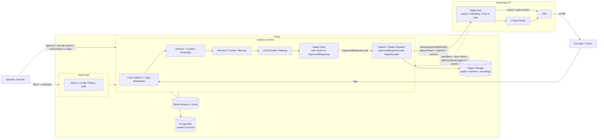

# VNova System Overview

Status: Draft, aligned to `vnova-review-handoff.md`

VNova is a production-grade LLM VTuber / AI talent broadcast runtime. It is a real-time broadcast control system with AI components, not a chatbot connected to an avatar.

## Initial Deployed Surfaces

The initial deployed surfaces are:

- `control-api`
- `session-runtime`
- `stage-host`
- `operator console`

The five planes are package/module boundaries, not five deployed services.

## Surface Responsibilities

### `control-api`

FastAPI, stateless. Owns admin APIs, config, policy, and auth surfaces.

### `session-runtime`

Python runtime with one logical actor per `StreamSession`. Owns chat collectors, input moderation, director, content scheduler, persona/prompt/memory orchestration, LLM provider gateway, safety gate invocation, and approved speech/avatar dispatch.

`packages/safety` is the only package allowed to construct `ApprovedResponse`.

### `stage-host`

Required local agent on the streaming PC. It maintains an authenticated WebSocket to `session-runtime`, consumes `SpeechTask`, manages local playback, drives OBS and VTube Studio, enforces local hard e-stop, runs the disconnect watchdog, buffers offline logs, and reports heartbeat and clock offset.

`stage-host` is the only consumer of `SpeechTask`.

### `operator console`

Next.js internal-only operator surface behind SSO/VPN. Commands go up via REST POST with idempotency keys. State can be pushed down via WebSocket or SSE. E-stop must not depend on console WebSocket health.

## Revised Topology

## Safety Shape

- `CandidateResponse` is unsafe by default.
- `ApprovedResponse` is the only response type that may be spoken.
- Safety unavailable means no autonomous speech.
- Provider fallback paths pass through the same safety gate as primary paths.
- TTS and media layers receive `approved_response_id`, never raw text.

## Data And Event Shape

- PostgreSQL is the system of record.
- Redis Streams is transport only.
- Event envelopes are versioned and defined in contract specs.
- Viewer memory and audit logs are separated.
- Stage-host events can be buffered offline and shipped after reconnect.

## Rehearsal Mode

Rehearsal mode must run the full pipeline against fake OBS, fake VTube Studio, and a virtual audio sink. It is required for CI e2e and for testing safety behavior without a live broadcast.
