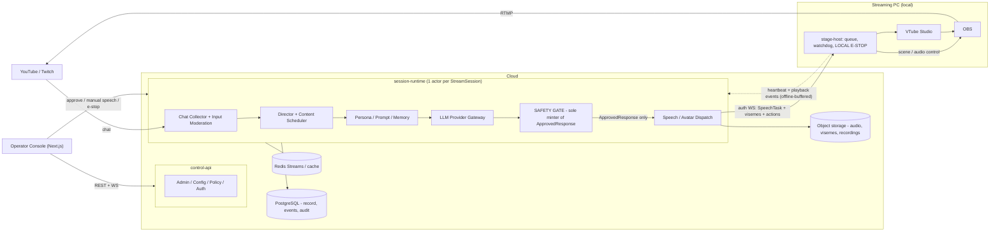

# VNova — External Architecture Review: Handoff & Decision Register

| | |
|---|---|
| Document type | Review handoff for implementation agent (Codex / GPT) |
| Source | External senior-staff architecture review (2026-07) |
| Applies to | "Architecture Review Request: LLM VTuber Production System / VNova" |
| Verdict | **REVISE, THEN GO** — no stop-level findings; revisions are additive and mostly *reduce* scope |

---

## 0. Instructions for the receiving model

You are acting as **implementation lead** for VNova. This document is the outcome of an external architecture review of the design document "Architecture Review Request: LLM VTuber Production System / VNova". Read both together. If you have not been given the original design document, say so before proceeding.

Rules of engagement:

1. Sections marked **BINDING** carry the force of accepted ADR content until a human explicitly overrides them. Do **not** silently implement something different. If you disagree with any item, state the disagreement and reasoning explicitly in your first response — then follow the binding decision unless the human releases you from it.
2. Sections marked **OPEN** require a human decision. Propose options with tradeoffs; do not decide unilaterally.
3. **Do not write implementation code yet.** Your first deliverables, in order:
   - (a) Gap analysis: original design vs. this document — enumerate what changes in `docs/`, `docs/adr/`, `packages/`, and the domain/event specs.
   - (b) Drafts of **ADR-016, ADR-017, ADR-018** (the P0 blockers in §11).
   - (c) `AGENTS.md` draft per §10, including the eight invariant laws **verbatim**.
   - (d) Updated `docs/architecture/system-overview.md` with the revised topology and Mermaid diagram from §3.
4. End your first response with three lists: acknowledged decisions, disagreements (may be empty), and questions for the human.

---

## 1. Review verdict (summary)

- **Quality:** above-average pre-implementation design. The core safety instinct — `CandidateResponse` and `ApprovedResponse` as distinct types with a mandatory gate between them — is correct and must be preserved.
- **Keep:** the Candidate/Approved type split; progressive autonomy modes; LLM gateway rule; versioned prompts/policies; audit-first data design; monorepo + contract-first governance; Postgres + pgvector + Redis; no Kubernetes; no framework-centric orchestration.
- **Top risks found:** (1) unmodeled cloud/local topology — part of the Media Plane physically runs on a local streaming PC; (2) chatbot-shaped `Turn` model vs. a continuous-broadcast product; (3) safety gate had no specified *enforcement mechanism*; (4) no latency budget; (5) no privacy/retention design (APPI applies); (6) five planes risked becoming five deployed services for a small team.

---

## 2. Critical corrections (BINDING)

**C1 — Add a stage-host.** OBS WebSocket, the VTube Studio API, and audio playout execute on a local streaming PC, not in the cloud. Define a `stage-host` agent on the rig: the **sole consumer** of `SpeechTask`s; local playback queue; VTS/OBS adapters; disconnect watchdog (auto-mute + fallback "BRB" scene after N seconds of cloud-link loss); offline log buffering with post-reconnect shipping; heartbeats and clock-offset reporting. → ADR-016.

**C2 — Layered emergency stop.** (a) **Local hard stop at stage-host:** cut the OBS audio source and flush the playback queue; reachable via a direct channel and a physical hotkey; must work with the cloud unreachable. (b) **Cloud freeze:** halt generation, drop in-flight turns. Stop = one click, idempotent, **no confirmation dialog**. Resume = confirmation + reason. Both audited. → ADR-015/016.

**C3 — Broadcast, not chatbot.** Add `StreamPlan` / `Segment` entities. Make the turn trigger polymorphic: `viewer_message | operator | scheduled_segment | idle_filler | system`. Add a content scheduler to the Conversation Director. Add a **staleness TTL on candidates** — expired candidates are discarded (event: `CandidateExpired`), never spoken. → ADR-003.

**C4 — Safety gate enforcement mechanics.** `packages/safety` is the **only** code able to construct `ApprovedResponse` (private constructor + factory; enforced by import-linter and CODEOWNERS). DB constraint: `approved_response` rows require an FK to a `safety_decision` with `decision = Approved`. TTS/media interfaces accept `approved_response_id` only — never raw text. Stage-host verifies a signed approval token per `SpeechTask`. **Fail closed:** safety unavailable ⇒ autonomous speech halts, mode auto-degrades, alert fires. → ADR-008.

**C5 — Broadcast surface inventory.** Voice is not the only output. Enumerate every surface reaching broadcast: voice, chat overlay, captions, alerts, scene text, **spoken usernames**. Every surface routes through moderation. Usernames are screened/normalized before speech. Chat overlay is either the system's own moderated component with delay, or absent — never the platform's raw chat. → ADR-021.

**C6 — Latency budget.** Proposed starting point: p50 message→first-audio ≤ 5–7 s (ingest ≤ 1 s; generation ≤ 2.5 s; safety ≤ 0.8 s; TTS ≤ 1.5 s; delivery/playout ≤ 0.5 s). **v1 evaluates the full response before synthesis**; sentence-chunked streaming with per-chunk safety is a future ADR. Note: platform video delay (2–10 s) buys slack. → ADR-018. (Numbers themselves: OPEN, see §13.)

**C7 — Privacy & retention (APPI).** Data classification + retention matrix per data class. Audit logs store internal IDs and hashes, **never viewer-memory content** — this makes deletion compatible with audit immutability. Embeddings carry a source-record FK for cascade delete. PII scrubbing before memory writes. → ADR-017.

**C8 — Three deployables, five packages.** The five planes are **package boundaries with enforced import rules**, not services. Deploy exactly: `control-api`, `session-runtime`, `stage-host` (+ operator console). → ADR-001/003.

---

## 3. Revised deployment topology (BINDING)

- **control-api** (FastAPI, stateless): admin, config, policy, auth.
- **session-runtime** (Python; **one logical actor per `StreamSession`**): chat collectors + input moderation; director + content scheduler; persona/prompt/memory; LLM provider gateway; safety gate (exclusive `ApprovedResponse` mint); speech/avatar dispatch. In-process module boundaries enforced by import rules; separable into services later without redesign.
- **stage-host** (local agent on streaming PC): authenticated WebSocket to runtime; playback queue; VTS/OBS adapters; watchdog; **local e-stop**; offline log buffer.
- **operator console** (Next.js, internal-only, behind SSO/VPN).

**Rehearsal mode (build early):** the full pipeline running against a rig simulator (fake VTS + fake OBS) and a virtual audio sink. Required for CI e2e and for testing safety behavior without a live broadcast.

---

## 4. Technology decisions

| # | Concern | Decision | Status |
|---|---|---|---|
| T1 | Operator console | Next.js + TS + TanStack Query + shadcn; client-heavy (no SSR dependence); deployed separately from any public surface; behind SSO/VPN | Accepted w/ conditions |
| T2 | Console real-time | State pushed *down* via WS or SSE; commands *up* via REST POST with idempotency keys; **e-stop must not depend on WS session health** | Accepted (BINDING) |
| T3 | Backend API | Python + FastAPI + Pydantic; domain logic in service layer; thin routes | Accepted |
| T4 | ORM | **SQLAlchemy 2.0** + separate Pydantic schemas (do not use SQLModel); Alembic | Accepted w/ conditions |
| T5 | Runtime workers | Python asyncio; separate processes from control-api; no CPU-heavy work in the event loop | Accepted w/ conditions |
| T6 | Event bus | **Redis Streams** behind a thin internal `EventBus` interface; bus is transport only (conditions in §4.1) | Accepted w/ conditions (BINDING) |
| T7 | System of record | **PostgreSQL** — turn states, safety decisions, audit, domain event log via outbox pattern; replay/reconstruction always from Postgres, never from Redis retention | BINDING |
| T8 | Vector search | pgvector for **Knowledge Base only**; viewer/character memory is key-lookup; per-viewer vector search deferred; dedicated vector DB deferred with written triggers (> low-millions vectors, recall/QPS problems, ops isolation) | Accepted |
| T9 | Orchestration frameworks | LangChain / LlamaIndex **rejected as architectural centers**; thin hand-rolled provider adapters inside the gateway | Rejected (frameworks) |
| T10 | Contract sharing | OpenAPI from FastAPI → generated TS client; event contracts as **JSON Schema in `packages/contracts`** generating both Pydantic and TS; Protobuf rejected for now | Accepted |
| T11 | Deployment target | session-runtime is long-lived and stateful → ECS Fargate or Fly.io; Cloud Run only with min-instances + verified WS timeout behavior; no Kubernetes initially | **OPEN** (pick target) |
| T12 | Secrets | Managed Secrets Manager; env-injected at deploy; never in images or logs; CI secret scanning | Accepted |
| T13 | Stage-host language | Python, or Node/Go for single-binary Windows distribution | **OPEN** |

### 4.1 Event bus conditions (BINDING)

- Versioned envelope: `event_id, type, schema_version, stream_session_id, turn_id?, occurred_at, payload`.
- Strict FIFO only per `stream_session_id` on the speech/avatar path (partition by session).
- Cloud↔stage-host is an **authenticated WebSocket**; Redis is never exposed to the rig.
- Many listed "events" are pipeline states of a `Turn`: model as a state-machine row updated per stage + emitted notifications, not accidental event sourcing.
- Switch-to-NATS triggers documented in ADR-004: ≥3 independent consumer services, cross-region, or retention/throughput beyond Postgres.

---

## 5. Domain model changes (BINDING)

1. `Turn : CandidateResponse` = **1:N** with a selected pointer; one `SafetyDecision` per candidate. (Retries, fallbacks, rewrites all produce multiple candidates.)
2. Remove `EmergencyStop` from the `SafetyDecision` enum — e-stop is a session-level operator/system event + session state, not a per-text judgment.
3. `Rewritten` decisions carry `rewritten_from_candidate_id`; rewrites **re-enter evaluation**; attempts capped (loop guard).
4. **Manual approval = `SafetyDecision` with `decided_by: operator_id`** — human and automated approval flow through one gate with uniform audit. `ApprovedResponse.approved_by` is not a parallel mechanism.
5. `AvatarAction` may exist without `speech_task_id` (idle motions, reactions).
6. New entities: `Operator` (identity, roles), `PromptVersion` and `PolicyVersion` as first-class, `StreamPlan`/`Segment`, `ProviderProfile`/`ModelConfig`, `VoiceProfile` with usage-rights metadata (ADR-022), `Recording`/`SessionArchive` (broadcast archive with offsets aligned to `turn_id`s), typed `MemoryRecord` (§8).
7. `CandidateResponse.raw_output` classified **restricted**: redacted in the console by default; reveal requires privileged role + logged reason.
8. **Never store:** secrets; platform OAuth tokens in logs; payment data; PII beyond platform ID + display-name snapshot; full prompts in ordinary logs (store a prompt *manifest* — template version + memory IDs + token counts — in events; full text in a restricted table).

---

## 6. Event model additions (BINDING)

Add: `ModeChanged` (critical omission — mode transitions are the most important operational events), `OperatorPresenceChanged`, `PolicyVersionActivated`, `PromptVersionActivated`, `MemoryWritten`, `MemoryDeleted`, `RigConnected`, `RigDisconnected`, `CandidateExpired`, `SafetyLayerUnavailable`, `FailClosedActivated`, `SilenceThresholdExceeded`, `CostBudgetWarning` (before `CostLimitReached`), `ManualSpeechSubmitted`.

---

## 7. Safety architecture requirements (BINDING)

**Structure — hybrid, layered, in order:**
1. Deterministic rules (blocklists, regex, PII detectors, format/length checks, allowed-topic constraints) — fast, cheap, testable, provider-independent.
2. Model-based classification on a **different vendor from the generator** (correlated-failure rule: one outage must not take out both generation and judgment).
3. Policy engine mapping `category × severity × current mode → action` (approve / rewrite / block / manual-queue / degrade-mode).

**Behavior rules:**
- Fail closed, always. Safety unavailable ⇒ autonomous speech halts, degrade to Mode 1/0, alert; pre-approved canned lines or fallback scene cover the gap.
- Borderline outputs → manual-review queue with a TTL; on expiry discard (filler or silence) — never speak by default.
- Provider **fallback paths route through the same gate** as primary paths.
- SSML/markup sanitization at the media boundary (injected TTS control tokens are an attack vector).
- Operator/manual speech is logged as `SafetyDecision(decided_by=operator)`; may carry a non-blocking advisory check.
- **Tool use is deferred from v1 entirely** (premature injection surface).

**Prompt injection defense in depth:** input tier (normalization, control-char stripping, heuristics, length caps, per-viewer rate limits, trust-level weighting); structural tier (viewer text only in delimited data slots, never system position, never tool authority); output tier (instruction-following anomaly and persona-break flags); memory tier (§8).

**Required safety tests:**
- Contract test: no code path delivers text to TTS without an `approved_response_id` (attempted DB insert violates the constraint; construction outside `packages/safety` fails import-linter).
- Fault injection: safety timeout ⇒ zero speech + mode degrade.
- E-stop with the cloud link severed ⇒ local audio dead within budget.
- Red-team fixture corpus (injection prompts, username attacks, SSML injection) as a CI regression suite.
- Rewrite-loop cap test.
- Full incident-timeline reconstruction from a synthetic session.

---

## 8. Memory architecture requirements (BINDING)

- **Remove Audit Log from the memory taxonomy** — it is observability data in a different plane with different access roles. Ephemeral/Session context is runtime state.
- Writes only via a post-turn extraction pipeline; every record carries provenance (`source_message_id`, `turn_id`).
- **Viewer memory = structured/typed slots** (nickname, favorite topic, milestones) — never free-text blobs (free text written today is prompt injection replayed tomorrow). Mode ≤ 1: writes operator-approved; Mode 2: auto-write low-risk structured slots only. Never store authority claims ("I'm your developer") or self-referential instructions.
- Deletion: viewer- and operator-initiated; cascades to embeddings via source-record FK; ordinary logs reference memory IDs, not content; a verification job proves absence.
- Retrieval: scoped queries (`viewer_id × character_id`); per-section token budgets; injected into a delimited, untrusted data section; retrieved memory IDs logged per turn.
- Embeddings = **derived cache**, always rebuildable from source records; `(embedding_model, version)` per row; lazy re-embed on model change.
- MVP: PostgreSQL only; pgvector for Knowledge Base only.

---

## 9. Observability requirements (BINDING)

**Logs to add:** prompt-assembly manifest per turn (template version, memory IDs, token counts per section — the primary incident artifact); stage-host local events buffered offline and shipped after reconnect; operator console command log with idempotency keys.

**Metrics to add:** `approval_queue_wait_ms` + operator SLA; `candidate_expired_count`; `safety_eval_latency_ms`; bus consumer lag; `rig_ws_rtt_ms`; `clock_skew_ms`; `audio_buffer_underrun_count`; OBS audio level (the source for `silent_duration_seconds`); `operator_presence`; moderation-API quota; chat-ingest gap detection (YouTube live-chat polling can stall silently).

**Tracing:** one OpenTelemetry trace per turn, ingest→playback, with stage-host spans corrected by measured clock offset.

**Day-one alerts:** rig disconnected during live; silence > threshold during live; safety-layer errors / fail-closed activation; e-stop triggered; provider hard-down; cost at 80% and 100%; operator absent in Mode ≥ 2; DLQ growth; approval-queue age.

**Dashboards:** live session ops (mode, per-stage latencies, queue depths, last N turns with status); safety decisions by category; provider health + cost burn per session.

---

## 10. Agent governance & AGENTS.md (BINDING)

**Repository:** monorepo confirmed. Add `packages/safety` (own package, CODEOWNERS-protected), `specs/events` as JSON Schema source generating Pydantic + TS, `tests/red-team/` fixtures.

**AGENTS.md must contain** (a) the eight invariant laws below **verbatim**, (b) required pre-commit commands, and (c): "When a requested change conflicts with an ADR or this document: open an ADR proposal — do not improvise."

**Invariant laws:**
1. Only `packages/safety` may construct `ApprovedResponse`.
2. TTS/media interfaces accept `approved_response_id` only — never raw text.
3. No LLM/TTS provider SDK import outside the provider gateways.
4. Every external call has an explicit timeout.
5. Provider fallback paths pass through the same safety gate as primary paths.
6. Fail closed: no safety verdict ⇒ no autonomous speech.
7. Schema migrations require a linked ADR reference.
8. Viewer memory and audit logs never share tables, content, or access roles.

**CI enforcement (trust CI, not the agent):** import-linter contracts (Python) for laws 1 and 3; dependency-cruiser (TS); schema-diff gate requiring an ADR label on migrations; contract-test suite as a required check; CODEOWNERS human review on `safety/`, `contracts/`, migrations, prompt templates, CI config, and AGENTS.md itself.

**No agent changes without human review:** the safety package, the e-stop path, migrations, prompt/persona templates (character integrity is a safety category — treat prompt files like code), policy defaults, `packages/contracts`, CI config, secrets/infra, AGENTS.md.

**Pre-merge gates for agent-generated changes:** type checks, import-linter, full contract suite, affected integration tests, red-team regression subset.

---

## 11. ADRs to add or modify

| ADR | Topic | Priority | Notes |
|---|---|---|---|
| ADR-016 | Stage host & cloud/local topology | **P0** | Blocks all Media Plane work; e-stop locality, sync, watchdog, offline log buffering |
| ADR-017 | Data retention, privacy, PII (APPI) | **P0** | Blocks schema design; retention matrix, deletion vs. audit immutability |
| ADR-018 | Latency budget & streaming strategy | **P0** | Blocks ADR-003/008/010 detail; batch-vs-chunked decision |
| ADR-019 | AuthN/AuthZ & operator roles | P1 | Blocks console; dangerous-action protection is an authz question, not a UI question |
| ADR-020 | Mode transition & degradation matrix | P1 | Keep separate from ADR-015 — it is the core operational contract |
| ADR-021 | Broadcast surface inventory & chat overlay policy | P1 | May be an ADR-008 appendix |
| ADR-022 | Voice rights & talent licensing metadata | P2 | `VoiceProfile` usage constraints as a system property |

**Ordering change:** ADR-008's enforcement invariant (who mints `ApprovedResponse`) must be decided **before** ADR-004 detail, because it shapes the pipeline.

**ADR-020 required content:** downward transitions always instant and always allowed; upward transitions require preconditions + operator confirmation; auto-degrade triggers (provider failure → Mode 1; safety escalation → Mode 0/1; operator absent in Mode ≥ 2 → degrade); per-content-category autonomy caps (e.g., sponsor reads never above Mode 1).

---

## 12. Implementation order (BINDING sequence)

1. **Scaffold + governance.** Monorepo; `packages/contracts` (event envelope JSON Schema → Pydantic/TS codegen); CI with import-linter + CODEOWNERS; ADR/AGENTS skeletons. Tests: codegen round-trip. [ADR-001, 002]
2. **Safety-critical domain schema.** `Turn`/`CandidateResponse`/`SafetyDecision`/`ApprovedResponse` types + Postgres schema with approval-chain constraints. Tests: contract tests proving the unsafe path cannot compile or insert. [ADR-008, 017]
3. **Event log + bus wrapper.** Postgres event table (outbox); thin Redis Streams `EventBus`; envelope validation. Tests: replay/reconstruction from Postgres. [ADR-004]
4. **LLM Provider Gateway.** One real + one mock provider; timeouts; fallback; cost accounting; import-linter rule live. Tests: fault injection (timeout, 5xx), fallback-through-gate. [ADR-007]
5. **Safety gate v1.** Rule engine + external moderation call + policy versioning + exclusive `ApprovedResponse` factory; fail-closed behavior. Tests: red-team fixtures, fail-closed injection, rewrite-loop cap. [ADR-008]
6. **Minimal runtime in Mode 1.** Scripted trigger → full turn pipeline with console/CLI approval; no live chat yet. Tests: e2e turn lifecycle, candidate staleness TTL. [ADR-003, 018, 020]
7. **TTS + SpeechTask.** TTS adapter; audio + visemes to object storage; ordered per-session queue; virtual audio sink (rehearsal mode). Tests: interruption semantics, TTS failure fallback, SSML sanitization. [ADR-010]
8. **Stage-host + simulators.** WS protocol; VTS/OBS adapters; disconnect watchdog (auto-mute + BRB); local e-stop; fake-VTS/fake-OBS. Tests: e-stop with cloud severed, watchdog trip, sync-drift detection. [ADR-016, 011, 015]
9. **Live chat ingestion.** Twitch first (EventSub/IRC simpler than YouTube polling); input moderation; username screening; rate/dedup/backpressure. Tests: injection fixtures at input tier, flood behavior. [ADR-003, 008]
10. **Operator console MVP.** Session state; approval queue with age indicators; e-stop; manual speech; mode control with the transition matrix. Tests: rehearsal-mode e2e (message → approval → spoken by simulator), authz on dangerous commands. [ADR-006, 019]

Then: first supervised live stream in Mode 1. Mode 2 gated on red-team pass + operator-presence enforcement.

---

## 13. OPEN decisions — require a human (do not decide unilaterally)

1. Latency budget numbers — confirm or adjust the proposal in C6.
2. Generator vs. safety-judge **vendor pairing** (they must differ; which pair).
3. Twitch-first vs. YouTube-first ingestion (review recommends Twitch first).
4. Deployment target: ECS Fargate vs. Fly.io (vs. Render with conditions).
5. Stage-host implementation language (Python vs. Node/Go single binary).
6. Chat overlay: build the moderated component now, or omit at launch.
7. Sentence-chunked streaming TTS: defer (recommended) or spec now as ADR.

---

## 14. Required format of your first response

1. **Acknowledged** — binding decisions you accept (may reference section numbers).
2. **Disagreements** — with reasoning (may be empty; do not manufacture disagreement).
3. **Gap analysis** — original design vs. this document, mapped to concrete file changes.
4. **Drafts** — ADR-016, ADR-017, ADR-018.
5. **AGENTS.md draft** — including the eight laws verbatim.
6. **Questions for the human** — including your proposals for the OPEN items in §13.
